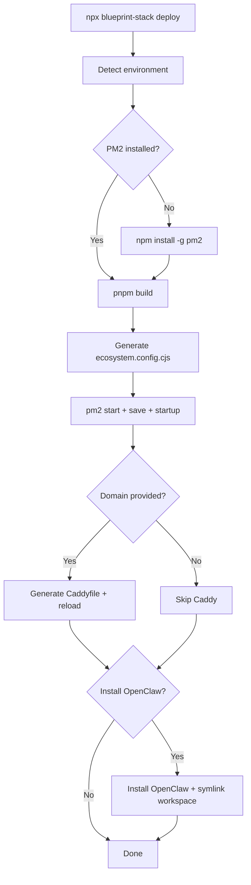

# CLI Deploy Command + OpenClaw Skill

## Part 1: `blueprint-stack deploy` CLI Command

### What It Does

After a user scaffolds with `npx blueprint-stack`, they run `blueprint-stack deploy` on the VPS and it handles the full production setup interactively:

```
npx blueprint-stack                  # scaffold the repo (already exists)
npx blueprint-stack deploy           # NEW: production deploy wizard
```

### User Flow



### Interactive Prompts

The deploy command asks a series of questions:

1. "Do you have a domain name?" -> if yes, ask for it (e.g., `aeir.ai`)
2. "Which apps should be public?" -> multi-select from apps registry (default: web, api, docs)
3. "Install OpenClaw agent gateway?" -> yes/no
4. "Connect a messaging channel now?" -> Telegram / WhatsApp / Skip

### Implementation

New file: [packages/blueprint-cli/src/commands/deploy.ts](packages/blueprint-cli/src/commands/deploy.ts)

The command:

1. Calls `findMonorepoRoot()` to ensure we're in a Blueprint project
2. Reads `packages/app-config/src/apps-registry.ts` at runtime (imports it or parses it)
3. Checks for PM2, installs if missing
4. Runs `pnpm build`
5. Generates `ecosystem.config.cjs` from the registry (using the correct `node_modules/next/dist/bin/next` path we debugged)
6. Runs `pm2 start`, `pm2 save`, prints the `pm2 startup` command for the user to copy
7. If domain provided: checks for Caddy, writes `/etc/caddy/Caddyfile` with one block per public app, reloads Caddy
8. If OpenClaw: runs the install script, symlinks workspace, prints next steps for channel setup

Register in [packages/blueprint-cli/src/index.ts](packages/blueprint-cli/src/index.ts) as a new commander command.

Also add `dev:os` to the proxy commands in [packages/blueprint-cli/src/commands/run.ts](packages/blueprint-cli/src/commands/run.ts) (currently missing).

### Key Code Decisions

- **ecosystem.config.cjs generation**: Read the apps registry and generate PM2 entries dynamically. For Next.js apps use `../../node_modules/next/dist/bin/next` with `interpreter: "node"`. For Fastify use `dist/index.js`. Skip mintlify/remotion/expo types.
- **Caddy**: Only write public apps (where `access === "public"` in registry). Requires sudo, so use `execa("sudo", ["tee", "/etc/caddy/Caddyfile"])`.
- **OpenClaw install**: Shell out to `curl -fsSL https://openclaw.ai/install.sh | bash`, then `ln -s` the workspace.

---

## Part 2: OpenClaw Skill (`blueprint-os`)

### What It Does

An OpenClaw skill that existing OpenClaw users install. Once installed, they message their agent:

> "Set up Blueprint as my OS"

And the agent clones the repo, builds it, configures PM2, symlinks the workspace, and restarts -- all from the chat.

### Skill Structure

OpenClaw skills follow a specific format. The skill lives in the repo at [skills/blueprint-os/](skills/blueprint-os/) and can also be published to ClawHub.

```
skills/blueprint-os/
  SKILL.md          # Instructions the agent reads when the skill is invoked
  setup.sh          # Helper script the agent can execute
```

### SKILL.md Content

The SKILL.md is injected into the agent's context when the skill is activated. It tells the agent exactly what to do:

```markdown
# Blueprint OS Skill

## When to Use

When the user asks to set up Blueprint, adopt Blueprint as the OS,
or scaffold a new Blueprint project.

## Setup Flow

1. Check prerequisites: Node 23+, pnpm 10+, git
2. Clone: git clone https://github.com/allenchuang/blueprint.git ~/repos/blueprint
3. cd ~/repos/blueprint && pnpm install
4. Create .env (ask user for DATABASE_URL)
5. pnpm build
6. Generate ecosystem.config.cjs (use the template below)
7. pm2 start ecosystem.config.cjs && pm2 save
8. Symlink workspace: ln -s ~/repos/blueprint ~/.openclaw/workspace
9. Notify user: "Blueprint is ready. Restart the gateway to load the new workspace."

## PM2 Config Template

(exact ecosystem.config.cjs content with the correct next binary path)

## After Setup

- Read AGENTS.md for governance rules
- Read SOUL.md, USER.md, TOOLS.md for context
- The agent is now operating inside Blueprint
```

### setup.sh Content

A helper script the agent can run instead of doing each step manually:

```bash
#!/usr/bin/env bash
set -euo pipefail
# Clone, install, build, PM2 start, symlink workspace
# Accepts DATABASE_URL as argument or prompts
```

### How Users Install It

**Option A: From the repo (local install)**

```bash
cp -r skills/blueprint-os ~/.openclaw/skills/blueprint-os
```

**Option B: The agent installs it itself**
The user messages: "Install the blueprint-os skill from [https://github.com/allenchuang/blueprint/tree/main/skills/blueprint-os](https://github.com/allenchuang/blueprint/tree/main/skills/blueprint-os)"

**Option C: Published to ClawHub** (future)

```bash
openclaw skills install blueprint-os
```

### Integration with Existing Docs

Add a new doc page: [apps/docs/deployment/openclaw-skill.mdx](apps/docs/deployment/openclaw-skill.mdx)

Explains the skill-based setup path for existing OpenClaw users who want the simplest possible onboarding.

---

## Summary of Files to Create/Modify

| File                                            | Action | Purpose                                |
| ----------------------------------------------- | ------ | -------------------------------------- |
| `packages/blueprint-cli/src/commands/deploy.ts` | Create | Deploy wizard command                  |
| `packages/blueprint-cli/src/index.ts`           | Modify | Register `deploy` command              |
| `packages/blueprint-cli/src/commands/run.ts`    | Modify | Add `dev:os` to proxy commands         |
| `skills/blueprint-os/SKILL.md`                  | Create | Agent instructions for Blueprint setup |
| `skills/blueprint-os/setup.sh`                  | Create | Helper script for automated setup      |
| `apps/docs/deployment/openclaw-skill.mdx`       | Create | Docs page for skill-based setup        |
| `apps/docs/mint.json`                           | Modify | Add skill page to Deployment nav       |
