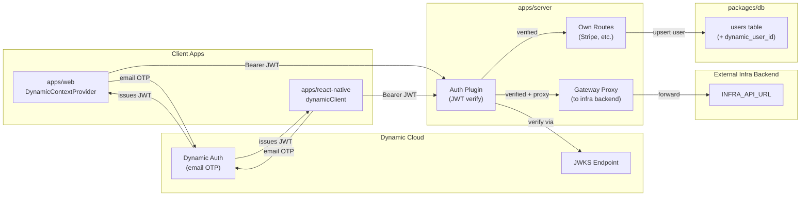

# Dynamic Auth Integration (Email Only)

## Architecture



**Flow:**

1. Client apps authenticate with Dynamic via email OTP and receive a JWT
2. Client apps send all API requests to `apps/server` with `Authorization: Bearer <token>` (using the existing `NEXT_PUBLIC_API_URL` / `EXPO_PUBLIC_API_URL`)
3. `apps/server` verifies the JWT via Dynamic's JWKS endpoint, upserts the user in the local DB
4. For its own routes (Stripe, etc.), the server handles the request directly
5. For infra routes, the server proxies the request to `INFRA_API_URL` (server-side env var)

## Prerequisites (manual)

Before running the code, the developer must:

1. Create a Dynamic account at [app.dynamic.xyz](https://app.dynamic.xyz)
2. Create a project and get the **Environment ID** from Dashboard > API tab
3. In Dashboard > Log in & User Profile, toggle **Email** ON and disable all other methods (wallets, social, SMS, passkey)

## 1. Web App (`apps/web`)

### Dependencies

```bash
pnpm add @dynamic-labs/sdk-react-core --filter web
```

No wallet connectors package needed since we only use email auth.

### New files

- `**[apps/web/src/lib/dynamic.ts](apps/web/src/lib/dynamic.ts)**` -- Feature flag + environment ID export, following the same graceful fallback pattern as `stripe.ts` and `elevenlabs.ts`:

```typescript
export const dynamicEnvironmentId =
  process.env.NEXT_PUBLIC_DYNAMIC_ENVIRONMENT_ID;
export const dynamicEnabled = Boolean(dynamicEnvironmentId);
```

- `**[apps/web/src/components/dynamic-provider.tsx](apps/web/src/components/dynamic-provider.tsx)**` -- `"use client"` provider wrapping `DynamicContextProvider` from `@dynamic-labs/sdk-react-core`. Configured with:
  - `environmentId` from env var
  - No `walletConnectors` (email-only, no wallet UI)
  - Conditional render: if `dynamicEnabled` is false, just render children (graceful fallback)
- `**[apps/web/src/hooks/use-auth.ts](apps/web/src/hooks/use-auth.ts)**` -- Wrapper hook using `useDynamicContext` and `useIsLoggedIn` from `@dynamic-labs/sdk-react-core`, plus `getAuthToken` for getting the JWT. Exports `useAuth()` returning `{ user, isLoggedIn, getToken }`. When Dynamic is not configured, returns a default unauthenticated state.

### Modified files

- `**[apps/web/src/app/layout.tsx](apps/web/src/app/layout.tsx)**` -- Add `DynamicAuthProvider` inside the provider tree
- `**[apps/web/.env.example](apps/web/.env.example)**` -- Add `NEXT_PUBLIC_DYNAMIC_ENVIRONMENT_ID=`

## 2. React Native App (`apps/react-native`)

### Dependencies

```bash
pnpm add @dynamic-labs/client @dynamic-labs/react-native-extension @dynamic-labs/react-hooks react-native-webview expo-secure-store --filter react-native
```

Needs `npx expo prebuild` after install (native modules). Not compatible with Expo Go -- requires dev build.

### New files

- `**[apps/react-native/lib/dynamic.ts](apps/react-native/lib/dynamic.ts)**` -- Feature flag (same pattern):

```typescript
export const dynamicEnvironmentId =
  process.env.EXPO_PUBLIC_DYNAMIC_ENVIRONMENT_ID;
export const dynamicEnabled = Boolean(dynamicEnvironmentId);
```

- `**[apps/react-native/lib/dynamic-client.ts](apps/react-native/lib/dynamic-client.ts)**` -- Creates and exports the `dynamicClient` using `createClient` from `@dynamic-labs/client` with `ReactNativeExtension`:

```typescript
import { createClient } from "@dynamic-labs/client";
import { ReactNativeExtension } from "@dynamic-labs/react-native-extension";
import { appConfig } from "@repo/app-config";

export const dynamicClient = createClient({
  environmentId: process.env.EXPO_PUBLIC_DYNAMIC_ENVIRONMENT_ID!,
  appName: appConfig.name,
}).extend(ReactNativeExtension());
```

- `**[apps/react-native/hooks/use-auth.ts](apps/react-native/hooks/use-auth.ts)**` -- Wrapper hook using `useReactiveClient` from `@dynamic-labs/react-hooks` to get reactive auth state. Same interface as web: `{ user, isLoggedIn, getToken }`. Token is accessed via `dynamicClient.auth.token`.

### Modified files

- `**[apps/react-native/app/_layout.tsx](apps/react-native/app/_layout.tsx)**` -- Add `DynamicWrapper` (conditional on `dynamicEnabled`) in the provider tree
- `**[apps/react-native/.env.example](apps/react-native/.env.example)**` -- Add `EXPO_PUBLIC_DYNAMIC_ENVIRONMENT_ID=`

## 3. Server (`apps/server`)

### Dependencies

```bash
pnpm add jsonwebtoken jwks-rsa --filter server
pnpm add -D @types/jsonwebtoken --filter server
```

### New files

- `**[apps/server/src/plugins/auth.ts](apps/server/src/plugins/auth.ts)**` -- Fastify plugin that:
  1. Checks for `DYNAMIC_ENVIRONMENT_ID` env var (graceful skip if missing)
  2. Creates a `jwks-rsa` client pointing at `https://app.dynamic.xyz/api/v0/sdk/{envId}/.well-known/jwks`
  3. Decorates `fastify.authenticate` -- a preHandler that extracts `Authorization: Bearer <token>`, verifies JWT signature + expiry + scope includes `user:basic`, and attaches `request.dynamicUser` (with `sub`, `email`, etc.)
  4. On successful auth, upserts the user in the local DB (match on `dynamic_user_id`, update email/name from JWT claims)

### Modified files

- `**[apps/server/src/app.ts](apps/server/src/app.ts)**` -- Register auth plugin
- `**[apps/server/.env.example](apps/server/.env.example)**` -- Add `DYNAMIC_ENVIRONMENT_ID=` and `INFRA_API_URL=`
- `**[apps/server/src/routes/stripe.ts](apps/server/src/routes/stripe.ts)**` -- Wire the `authenticate` preHandler to `subscription-status` route so it resolves the real `userId` from the JWT

### Gateway behavior

`INFRA_API_URL` is a **server-side only** env var. When the server needs to forward authenticated requests to the external infra backend, it uses this URL. Client apps never call the infra backend directly -- they always go through `apps/server`.

## 4. Database (`packages/db`)

### Modified files

- `**[packages/db/src/schema/users.ts](packages/db/src/schema/users.ts)` -- Add `dynamicUserId` column (text, unique, nullable) to map Dynamic's `sub` claim to the local user:

```typescript
dynamicUserId: text("dynamic_user_id").unique(),
```

Run `pnpm db:generate` after this change.

## 5. Environment Variables

| Location            | Variable                             | Visibility  | Value                                                   |
| ------------------- | ------------------------------------ | ----------- | ------------------------------------------------------- |
| `apps/web`          | `NEXT_PUBLIC_DYNAMIC_ENVIRONMENT_ID` | Client-side | From Dynamic dashboard                                  |
| `apps/react-native` | `EXPO_PUBLIC_DYNAMIC_ENVIRONMENT_ID` | Client-side | Same environment ID                                     |
| `apps/server`       | `DYNAMIC_ENVIRONMENT_ID`             | Server-side | Same environment ID                                     |
| `apps/server`       | `INFRA_API_URL`                      | Server-side | External backend URL (e.g. `https://infra.example.com`) |

Client apps use the existing `NEXT_PUBLIC_API_URL` / `EXPO_PUBLIC_API_URL` (pointing to `apps/server`) for all API calls. The server proxies to `INFRA_API_URL` when needed.

## 6. Cursor Rule (`020-dynamic-auth.mdc`)

Create a new rule synced across `.cursor/rules/`, `.agents/rules/`, and `.claude/rules/` that documents:

- Dynamic is the **sole auth provider** -- never use NextAuth, Clerk, Auth.js, or other auth libraries
- **Email-only** authentication -- no wallet connectors, no social providers
- Feature flag pattern: check `dynamicEnabled` before rendering auth UI
- Web uses `DynamicContextProvider` from `@dynamic-labs/sdk-react-core`
- React Native uses `createClient` from `@dynamic-labs/client` + `@dynamic-labs/react-native-extension`
- `apps/server` verifies JWT via JWKS endpoint with `jsonwebtoken` + `jwks-rsa`
- Always verify `scope` includes `user:basic` on the server
- Server upserts users in local DB on successful auth (maps `dynamic_user_id`)
- Server proxies authenticated requests to `INFRA_API_URL` -- clients never call infra directly
- Use the `useAuth()` hook (in both client apps) for auth state
- `getAuthToken()` (web) or `dynamicClient.auth.token` (RN) to get the JWT for API calls
- Graceful fallback when env vars are missing (app works without auth)

## 7. README / AGENTS.md Updates

- Update root `README.md` Built-in Features to include Dynamic auth
- Update `apps/web/AGENTS.md` and `apps/react-native/AGENTS.md` with auth-related directories and rules
- Update `apps/server/AGENTS.md` with auth plugin info
- Update `AGENTS.md` (root) with auth rule reference

## Files Changed Summary

| File                                           | Action                                         |
| ---------------------------------------------- | ---------------------------------------------- |
| `apps/web/package.json`                        | Add `@dynamic-labs/sdk-react-core`             |
| `apps/web/src/lib/dynamic.ts`                  | **New** -- feature flag                        |
| `apps/web/src/components/dynamic-provider.tsx` | **New** -- provider wrapper                    |
| `apps/web/src/hooks/use-auth.ts`               | **New** -- auth hook                           |
| `apps/web/src/app/layout.tsx`                  | Add Dynamic provider                           |
| `apps/web/.env.example`                        | Add Dynamic env var                            |
| `apps/react-native/package.json`               | Add Dynamic packages                           |
| `apps/react-native/lib/dynamic.ts`             | **New** -- feature flag                        |
| `apps/react-native/lib/dynamic-client.ts`      | **New** -- client setup                        |
| `apps/react-native/hooks/use-auth.ts`          | **New** -- auth hook                           |
| `apps/react-native/app/_layout.tsx`            | Add Dynamic wrapper                            |
| `apps/react-native/.env.example`               | Add Dynamic env var                            |
| `apps/server/package.json`                     | Add `jsonwebtoken`, `jwks-rsa`                 |
| `apps/server/src/plugins/auth.ts`              | **New** -- JWT verification + user upsert      |
| `apps/server/src/app.ts`                       | Register auth plugin                           |
| `apps/server/.env.example`                     | Add `DYNAMIC_ENVIRONMENT_ID` + `INFRA_API_URL` |
| `apps/server/src/routes/stripe.ts`             | Add auth preHandler                            |
| `packages/db/src/schema/users.ts`              | Add `dynamic_user_id` column                   |
| `.cursor/rules/020-dynamic-auth.mdc`           | **New** -- auth rule                           |
| `.agents/rules/020-dynamic-auth.mdc`           | **New** -- synced rule                         |
| `.claude/rules/020-dynamic-auth.mdc`           | **New** -- synced rule                         |
| Root `README.md`                               | Add Dynamic auth to features                   |
| Root `AGENTS.md`                               | Add auth rule reference                        |
| `apps/web/AGENTS.md`                           | Update with auth info                          |
| `apps/react-native/AGENTS.md`                  | Update with auth info                          |
| `apps/server/AGENTS.md`                        | Update with auth plugin info                   |
