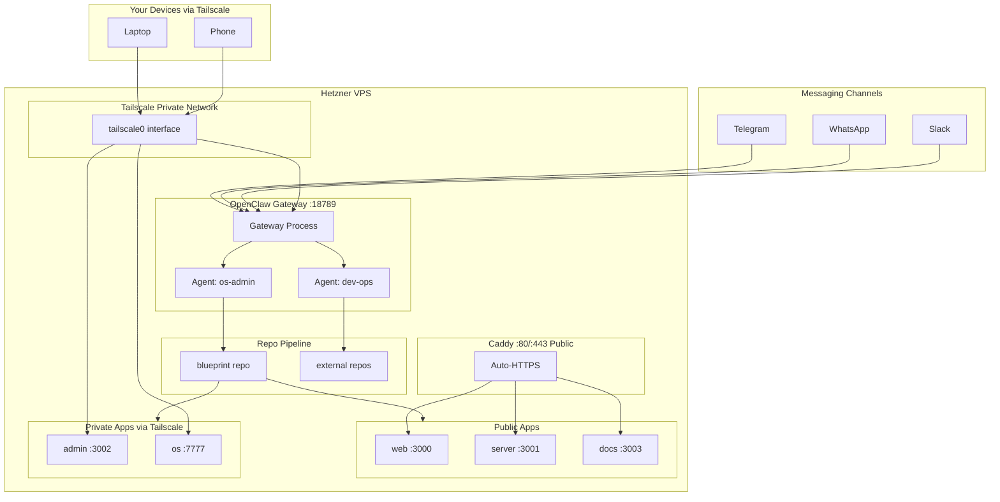
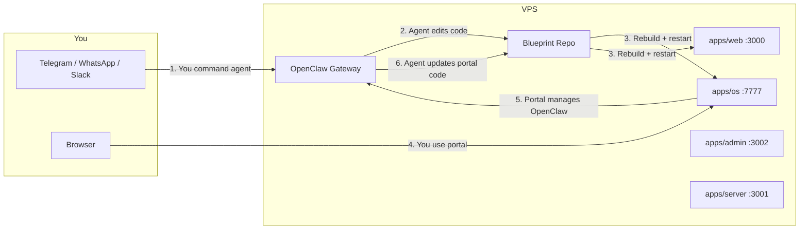
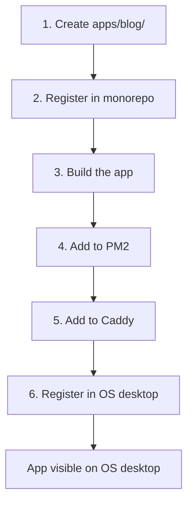
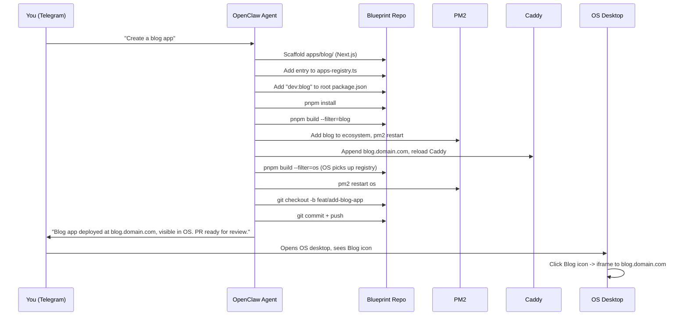

# OpenClaw + Blueprint Monorepo VPS Deployment Plan

---

## Step-by-Step Walkthrough (Beginner-Friendly)

This section walks you through every step in order. Steps are marked:

- **[BROWSER]** -- You need to do something in a web browser (sign up, click buttons, copy values)
- **[TERMINAL]** -- You run commands in a terminal (I'll give you exact commands to copy-paste)
- **[PHONE]** -- You need your phone for something (QR scan, app install)
- **[CODE]** -- I can do this for you in Cursor before we deploy

### Pre-Setup Checklist

Before starting, have these ready:

- A credit/debit card (for Hetzner billing)
- Your GitHub repo URL for Blueprint
- A Telegram account on your phone
- Your laptop terminal app (Terminal on Mac)

---

### Step 1: Create an AWS Account [BROWSER]

1. Go to [https://aws.amazon.com/](https://aws.amazon.com/) and click **Create an AWS Account**
2. Enter your email, choose an account name
3. Verify your email with the code they send
4. Enter your billing info (credit card required -- you won't be charged until usage exceeds free tier)
5. Choose the **Basic (Free)** support plan
6. Sign in to the [AWS Console](https://console.aws.amazon.com/)

### Step 2: Create Your SSH Key Pair [BROWSER + TERMINAL]

You need an SSH key to log into your EC2 instance.

**Check if you already have one** (on your Mac):

```bash
ls ~/.ssh/id_ed25519.pub
```

If that file exists, you already have a key. Copy it to your clipboard:

```bash
cat ~/.ssh/id_ed25519.pub | pbcopy
```

If it does NOT exist, generate one:

```bash
ssh-keygen -t ed25519 -C "your-email@example.com"
# Press Enter for all prompts (default location, no passphrase is fine for now)

cat ~/.ssh/id_ed25519.pub | pbcopy
```

**[BROWSER] Import it into AWS:**

1. Go to [EC2 Console](https://console.aws.amazon.com/ec2/)
2. In the left sidebar, click **Key Pairs** (under Network & Security)
3. Click **Actions** > **Import key pair**
4. Name: `macbook-key`
5. Paste your public key from clipboard
6. Click **Import key pair**

### Step 3: Create the EC2 Instance [BROWSER]

1. Go to [EC2 Console](https://console.aws.amazon.com/ec2/) > **Launch instance**
2. **Name**: `blueprint-vps`
3. **AMI**: Ubuntu Server 24.04 LTS (should be the first option under Quick Start)
4. **Instance type**: Pick based on your needs:

| Instance  | vCPUs | RAM   | Monthly Cost | Notes                          |
| --------- | ----- | ----- | ------------ | ------------------------------ |
| t3.medium | 2     | 4 GB  | ~$30         | Minimum viable (tight on RAM)  |
| t3.large  | 2     | 8 GB  | ~$60         | **Recommended** -- comfortable |
| t3.xlarge | 4     | 16 GB | ~$120        | If cost is no issue            |

1. **Key pair**: Select `macbook-key` (the one you just imported)
2. **Network settings**: Click **Edit**, then:

- **Auto-assign public IP**: Enable
- **Security group**: Create new, name it `blueprint-sg`
- Add these inbound rules:
  - SSH (port 22) -- Source: My IP
  - HTTP (port 80) -- Source: Anywhere (0.0.0.0/0)
  - HTTPS (port 443) -- Source: Anywhere (0.0.0.0/0)

1. **Storage**: Change to **30 GB** gp3 (default 8 GB is too small)
2. Click **Launch instance**

**[BROWSER] Allocate a static IP (Elastic IP):**

Without this, your IP changes every time the instance restarts.

1. Go to EC2 > **Elastic IPs** (left sidebar under Network & Security)
2. Click **Allocate Elastic IP address** > **Allocate**
3. Select the new IP > **Actions** > **Associate Elastic IP address**
4. Select your `blueprint-vps` instance > **Associate**
5. **Write down this IP address** -- this is your permanent server IP

### Step 4: SSH Into Your Instance [TERMINAL]

```bash
ssh ubuntu@YOUR_ELASTIC_IP
# Replace YOUR_ELASTIC_IP with the IP from Step 3
# Type "yes" when asked about fingerprint
```

Note: AWS Ubuntu instances use the `ubuntu` user (not `root`). This user already has sudo access.

### Step 5: Set Up the Server [TERMINAL]

You're now on the EC2 instance. AWS Ubuntu already has a non-root user (`ubuntu`) with sudo, so no need to create one. We'll create a `deploy` user to keep things clean:

```bash
sudo adduser deploy
# Set a password when prompted
sudo usermod -aG sudo deploy
```

```bash
# Allow the deploy user to SSH in with your key
sudo mkdir -p /home/deploy/.ssh
sudo cp ~/.ssh/authorized_keys /home/deploy/.ssh/
sudo chown -R deploy:deploy /home/deploy/.ssh
sudo chmod 700 /home/deploy/.ssh
sudo chmod 600 /home/deploy/.ssh/authorized_keys
```

Note: AWS uses Security Groups instead of ufw for firewall. You already configured the Security Group in Step 3. No ufw commands needed.

```bash
# Switch to deploy user for the rest
sudo su - deploy
```

**Alternative: Hetzner Cloud (cheaper)**

If you prefer Hetzner (~$8-40/month instead of ~$30-120/month for equivalent specs):

1. Go to [https://accounts.hetzner.com/signUp](https://accounts.hetzner.com/signUp) and create an account
2. Go to [https://console.hetzner.cloud](https://console.hetzner.cloud)
3. Create a new project > "Add Server"
4. **Location**: Ashburn (US) or Falkenstein (EU)
5. **Image**: Ubuntu 24.04
6. **Type**: CX42 (8 vCPU, 16 GB RAM, ~EUR 14.50/month)
7. **SSH keys**: Add your public key
8. SSH in: `ssh root@YOUR_HETZNER_IP`
9. Create the deploy user (same commands as above)
10. Set up firewall with ufw:

```bash
apt update && apt install -y ufw
ufw allow OpenSSH
ufw allow 80
ufw allow 443
ufw --force enable
```

From Step 6 onward, all commands are identical regardless of provider.

### Step 6: Install Node.js, pnpm, and Tools [TERMINAL]

Still on the VPS, as the `deploy` user:

```bash
# Install nvm (Node version manager)
curl -o- https://raw.githubusercontent.com/nvm-sh/nvm/v0.40.1/install.sh | bash
source ~/.bashrc

# Install Node 24
nvm install 24
nvm use 24
node --version  # Should print v24.x.x

# Install pnpm
corepack enable
corepack prepare pnpm@latest --activate
pnpm --version  # Should print 10.x.x

# Install PM2 (process manager)
npm install -g pm2
```

### Step 7: Install Caddy [TERMINAL]

```bash
# Need sudo for this
sudo apt install -y debian-keyring debian-archive-keyring apt-transport-https curl
curl -1sLf 'https://dl.cloudsmith.io/public/caddy/stable/gpg.key' | sudo gpg --dearmor -o /usr/share/keyrings/caddy-stable-archive-keyring.gpg
curl -1sLf 'https://dl.cloudsmith.io/public/caddy/stable/debian.deb.txt' | sudo tee /etc/apt/sources.list.d/caddy-stable.list
sudo apt update && sudo apt install caddy
```

### Step 8: Set Up GitHub SSH Deploy Key [TERMINAL + BROWSER]

**On the VPS:**

```bash
# Generate a deploy key
ssh-keygen -t ed25519 -C "openclaw-agent-blueprint" -f ~/.ssh/openclaw_blueprint -N ""

# Print the public key -- COPY THIS
cat ~/.ssh/openclaw_blueprint.pub
```

**[BROWSER] On GitHub:**

1. Go to your Blueprint repo on GitHub
2. Click **Settings** > **Deploy keys** > **Add deploy key**
3. Title: `VPS Deploy Key`
4. Paste the public key you copied
5. Check **Allow write access**
6. Click **Add key**

**Back on the VPS:**

```bash
# Configure SSH to use this key for GitHub
cat >> ~/.ssh/config << 'EOF'
Host github.com
  IdentityFile ~/.ssh/openclaw_blueprint
  IdentitiesOnly yes
EOF
chmod 600 ~/.ssh/config

# Set git identity for agent commits
git config --global user.name "OpenClaw Agent"
git config --global user.email "openclaw@yourdomain.com"

# Test the connection
ssh -T git@github.com
# Should print: "Hi youruser/blueprint! You've successfully authenticated..."
```

### Step 9: Clone and Build the Monorepo [TERMINAL]

```bash
mkdir -p ~/repos
cd ~/repos
git clone git@github.com:allenchuang/blueprint.git
# Replace YOUR_USER with your GitHub username
cd blueprint
pnpm install
```

Create the `.env` file (you'll need your DATABASE_URL):

```bash
cp .env.example .env
nano .env
# Fill in DATABASE_URL and any other required values
# Press Ctrl+X, then Y, then Enter to save
```

Build all apps:

```bash
pnpm build
```

This will take a few minutes. Wait for it to finish.

### Step 10: Start Apps with PM2 [TERMINAL]

```bash
cd ~/repos/blueprint

# Create the PM2 config
cat > ecosystem.config.cjs << 'EOF'
module.exports = {
  apps: [
    { name: "web",    cwd: "./apps/web",    script: "node_modules/.bin/next", args: "start -p 3000" },
    { name: "server", cwd: "./apps/server", script: "dist/index.js" },
    { name: "admin",  cwd: "./apps/admin",  script: "node_modules/.bin/next", args: "start -p 3002" },
    { name: "os",     cwd: "./apps/os",     script: "node_modules/.bin/next", args: "start -p 7777" },
  ],
};
EOF

# Start all apps
pm2 start ecosystem.config.cjs

# Save so they restart on reboot
pm2 save
pm2 startup
# PM2 will print a command starting with "sudo env..." -- copy and run that command
```

Verify everything is running:

```bash
pm2 status
# Should show web, server, admin, os all as "online"
```

### Step 11: Configure Caddy (Public Apps) [TERMINAL]

Skip this step if you don't have a domain yet. You can access apps directly via `http://YOUR_VPS_IP:PORT` for now.

If you have a domain, point DNS A records to your VPS IP first **[BROWSER]**, then:

```bash
sudo tee /etc/caddy/Caddyfile << 'EOF'
app.yourdomain.com {
    reverse_proxy localhost:3000
}
api.yourdomain.com {
    reverse_proxy localhost:3001
}
EOF
sudo systemctl reload caddy
```

### Step 12: Install Tailscale [TERMINAL + BROWSER + PHONE]

**On the VPS:**

```bash
curl -fsSL https://tailscale.com/install.sh | sh
sudo tailscale up
```

This prints a URL. **[BROWSER]** Open that URL -- it takes you to Tailscale's site.

1. If you don't have a Tailscale account, sign up (free, use Google/GitHub login)
2. Approve the device

**[PHONE/LAPTOP] On your personal devices:**

- **Mac**: Download from [tailscale.com/download](https://tailscale.com/download), install, sign in with the same account
- **iPhone**: Install "Tailscale" from the App Store, sign in
- **Android**: Install "Tailscale" from Play Store, sign in

**Back on the VPS -- set up private access:**

```bash
# Expose private apps via Tailscale
sudo tailscale serve --bg --https=7777 7777
sudo tailscale serve --bg --https=3002 3002
sudo tailscale serve --bg --https=18789 18789

# Find your VPS's Tailscale name
tailscale status
# Note the name, e.g., "blueprint-vps.tail1234.ts.net"
```

Now test from your laptop's browser:

- `https://blueprint-vps.tail1234.ts.net:7777` -- should show the OS desktop
- `https://blueprint-vps.tail1234.ts.net:3002` -- should show the admin panel

### Step 13: Install OpenClaw [TERMINAL]

```bash
curl -fsSL https://openclaw.ai/install.sh | bash
openclaw onboard --install-daemon
```

The onboard wizard will ask you questions interactively. Follow the prompts. When it asks about channels, you can skip for now -- we'll set up Telegram in the next step.

### Step 14: Point OpenClaw at Your Repo [TERMINAL]

```bash
# Symlink OpenClaw workspace to the Blueprint repo
rm -rf ~/.openclaw/workspace
ln -s /home/deploy/repos/blueprint ~/.openclaw/workspace

# Configure OpenClaw gateway for Tailscale
openclaw config set gateway.bind tailnet
openclaw config set gateway.auth.allowTailscale true
```

### Step 15: Create a Telegram Bot [PHONE + TERMINAL]

**[PHONE]** On Telegram:

1. Open Telegram and search for `@BotFather`
2. Send `/newbot`
3. Choose a name (e.g., "Blueprint Agent")
4. Choose a username (e.g., `blueprint_agent_bot` -- must end in `bot`)
5. BotFather gives you a token like `123456:ABC-DEF...` -- **copy this token**

**[TERMINAL] On the VPS:**

```bash
openclaw config set channels.telegram.enabled true
openclaw config set channels.telegram.botToken "PASTE_YOUR_TOKEN_HERE"
openclaw config set channels.telegram.dmPolicy pairing

# Restart the gateway to pick up the channel
openclaw gateway restart
```

**[PHONE]** Send a message to your bot on Telegram. It will give you a pairing code.

**[TERMINAL]** Approve the pairing:

```bash
openclaw pairing list telegram
openclaw pairing approve telegram THE_CODE
```

Now message your bot again -- it should respond. You're connected.

### Step 16: Configure the Agent for Your Repo [CODE]

This is where I come in. I'll create/update these files in your repo:

- Update `AGENTS.md` with governance rules
- Create `SOUL.md`, `USER.md`, `TOOLS.md`, `BOOT.md`, `HEARTBEAT.md`
- Create `storage/` directory structure
- Create `ecosystem.config.cjs`

Then you push to GitHub, pull on the VPS, and the agent knows its operating system.

---

### Summary: What Needs You vs What I Can Do

| Step | What                    | Type                             | Notes                               |
| ---- | ----------------------- | -------------------------------- | ----------------------------------- |
| 1    | Create AWS account      | **[BROWSER]**                    | One-time, ~5 min (or Hetzner alt)   |
| 2    | SSH key + import to AWS | **[TERMINAL + BROWSER]**         | Generate key, import in EC2 console |
| 3    | Launch EC2 instance     | **[BROWSER]**                    | EC2 console + Elastic IP, ~5 min    |
| 4    | SSH in                  | **[TERMINAL]**                   | One command                         |
| 5-7  | Server setup            | **[TERMINAL]**                   | Copy-paste commands, ~15 min        |
| 8    | Deploy key              | **[TERMINAL + BROWSER]**         | Generate on VPS, paste in GitHub    |
| 9    | Clone + build           | **[TERMINAL]**                   | Copy-paste, wait for build          |
| 10   | Start PM2               | **[TERMINAL]**                   | Copy-paste                          |
| 11   | Caddy config            | **[TERMINAL]**                   | Skip if no domain yet               |
| 12   | Tailscale               | **[TERMINAL + BROWSER + PHONE]** | Install on VPS + your devices       |
| 13   | Install OpenClaw        | **[TERMINAL]**                   | Installer + wizard                  |
| 14   | Link workspace          | **[TERMINAL]**                   | Two commands                        |
| 15   | Telegram bot            | **[PHONE + TERMINAL]**           | BotFather + pairing                 |
| 16   | Agent config files      | **[CODE]**                       | I do this in Cursor                 |

---

---

## Documentation Plan (apps/docs/)

The existing docs have 3 pages: `introduction.mdx`, `quickstart.mdx`, `architecture.mdx` plus placeholder API docs. We'll add three new doc sections as top-level tabs so the navigation becomes:

**Existing tabs:** Get Started | API Reference
**New tabs:** Concepts | Deployment | Extending

### New Directory Structure

```
apps/docs/
  introduction.mdx              # Update: add OpenClaw/OS mentions
  quickstart.mdx                # Update: mention deployment option
  architecture.mdx              # Update: add OS + OpenClaw to diagram
  concepts/                     # NEW TAB: How things work
    how-it-works.mdx
    the-os.mdx
    agent-governance.mdx
    bidirectional-loop.mdx
    apps-registry.mdx
  deployment/                   # NEW TAB: Step-by-step deployment
    overview.mdx
    vps-setup.mdx
    github-deploy-keys.mdx
    monorepo-on-vps.mdx
    caddy-reverse-proxy.mdx
    tailscale.mdx
    openclaw-setup.mdx
    connect-telegram.mdx
    connect-whatsapp.mdx
    connect-slack.mdx
  extending/                    # NEW TAB: Adding to the system
    adding-an-app.mdx
    deploy-pipeline.mdx
    multi-repo-pipeline.mdx
    file-storage.mdx
    custom-agents.mdx
  mint.json                     # Updated navigation
```

### Updated mint.json Navigation

```json
{
  "tabs": [
    { "name": "Concepts", "url": "concepts" },
    { "name": "Deployment", "url": "deployment" },
    { "name": "Extending", "url": "extending" },
    { "name": "API Reference", "url": "api-reference" }
  ],
  "navigation": [
    {
      "group": "Get Started",
      "pages": ["introduction", "quickstart", "architecture"]
    },
    {
      "group": "Concepts",
      "pages": [
        "concepts/how-it-works",
        "concepts/the-os",
        "concepts/agent-governance",
        "concepts/bidirectional-loop",
        "concepts/apps-registry"
      ]
    },
    {
      "group": "Deploy to Production",
      "pages": [
        "deployment/overview",
        "deployment/vps-setup",
        "deployment/github-deploy-keys",
        "deployment/monorepo-on-vps",
        "deployment/caddy-reverse-proxy",
        "deployment/tailscale",
        "deployment/openclaw-setup",
        "deployment/connect-telegram",
        "deployment/connect-whatsapp",
        "deployment/connect-slack"
      ]
    },
    {
      "group": "Extend the System",
      "pages": [
        "extending/adding-an-app",
        "extending/deploy-pipeline",
        "extending/multi-repo-pipeline",
        "extending/file-storage",
        "extending/custom-agents"
      ]
    },
    {
      "group": "API Reference",
      "pages": ["api-reference/introduction"]
    },
    {
      "group": "Endpoints",
      "pages": ["api-reference/endpoint/get", "api-reference/endpoint/create"]
    }
  ]
}
```

---

### Page-by-Page Content Plan

#### Concepts Tab -- "How does this work?"

These pages explain the ideas to someone who has never seen the project. No terminal commands -- just concepts, diagrams, and architecture.

`**concepts/how-it-works.mdx**` -- The Big Picture

- What this project is: a monorepo that doubles as an AI agent's operating system
- High-level diagram: You <-> Messaging <-> OpenClaw <-> Monorepo <-> Apps
- What OpenClaw is (brief, link to their docs)
- What the monorepo provides (web apps, admin, API, OS desktop, video generation)
- The "full cycle" concept in one paragraph

`**concepts/the-os.mdx**` -- The Desktop Environment

- What `apps/os/` is and what it does
- Screenshot or diagram of the desktop with labeled windows
- How windows work: browser windows (iframes to other apps) vs app windows (React components)
- The `DesktopConfig` concept: windows, icons, backgrounds, auto-open
- How the OS acts as a command center for all your apps

`**concepts/agent-governance.mdx**` -- Rules and Boundaries

- Why governance matters: AI agents with code access need guardrails
- The AGENTS.md contract: what the agent can and cannot do
- Hard rules (never delete apps, never push to main, never commit secrets)
- Allowed actions (create apps, edit code, git branch/commit/push, download assets)
- The git workflow for agents: feature branches, conventional commits, PR review
- How SOUL.md, USER.md, and TOOLS.md shape agent behavior

`**concepts/bidirectional-loop.mdx**` -- The Control Loop

- Diagram: three loops with arrows
  - Loop 1: You -> Telegram -> OpenClaw -> edits repo -> apps update
  - Loop 2: You -> OS desktop -> server API -> manages OpenClaw
  - Loop 3: OpenClaw -> edits repo -> OS/web/admin rebuild -> you see changes
- Why this matters: the system manages itself
- Real-world examples of each loop

`**concepts/apps-registry.mdx**` -- Single Source of Truth for Apps

- The problem: adding an app requires editing 6 files
- The solution: `packages/app-config/src/apps-registry.ts`
- What the registry contains: id, name, port, subdomain, icon, color
- How the OS reads from it to auto-generate desktop icons
- How deploy scripts read from it to auto-configure PM2 and Caddy

#### Deployment Tab -- "How do I set this up?"

Step-by-step guides. Each page is one self-contained task. Uses Mintlify `<Steps>` components heavily.

`**deployment/overview.mdx**` -- Deployment Overview

- What you'll end up with (architecture diagram)
- Time estimate (~1 hour)
- Cost estimate (~$8-40/month)
- Prerequisites checklist
- Table of steps with links to each page
- Which steps need human intervention (labeled with icons)

`**deployment/vps-setup.mdx**` -- Provision a VPS

- Uses Mintlify `<Tabs>` to show both AWS EC2 and Hetzner side by side
- AWS path: account creation, EC2 launch, Security Groups, Elastic IP, instance types (t3.medium/large/xlarge)
- Hetzner path: account creation, server creation, ufw firewall, instance types (CX32/CX42/CX52)
- Generating and importing SSH keys (shared across both)
- Instance type comparison table (both providers with costs)
- First SSH login (ubuntu@ for AWS, root@ for Hetzner)
- Creating the deploy user
- Installing Node.js, pnpm, PM2
- Covers Steps 1-7 from the walkthrough

`**deployment/github-deploy-keys.mdx**` -- GitHub Authentication

- Why deploy keys (not PATs or personal SSH keys)
- Generating the key on the VPS
- Adding to GitHub (with "go to Settings > Deploy keys" walkthrough)
- SSH config
- Verification
- Multi-repo setup (host aliases)
- Covers Step 8

`**deployment/monorepo-on-vps.mdx**` -- Deploy the Monorepo

- Cloning the repo
- Environment variables (.env setup)
- Building all apps
- PM2 ecosystem config explained
- Starting, saving, and auto-restart on boot
- Verifying everything is running
- Covers Steps 9-10

`**deployment/caddy-reverse-proxy.mdx**` -- Public HTTPS with Caddy

- What Caddy is and why (auto-HTTPS, simpler than Nginx)
- DNS setup: pointing A records to your VPS
- The Caddyfile: one block per public app
- Which apps are public vs private
- Reloading Caddy
- Troubleshooting: certificate issues, 502 errors
- Covers Step 11

`**deployment/tailscale.mdx**` -- Private Access with Tailscale

- What Tailscale is (mesh VPN, simple explanation)
- Installing on the VPS
- Installing on your laptop and phone
- Tailscale Serve for private HTTPS
- Configuring OpenClaw to trust Tailscale
- The access split table (public via Caddy vs private via Tailscale)
- Updated firewall rules
- Covers Step 12

`**deployment/openclaw-setup.mdx**` -- Install and Configure OpenClaw

- Installing OpenClaw
- The onboard wizard
- Linking the workspace to the repo (symlink)
- The openclaw.json config explained section by section
- Multi-agent setup: os-admin and dev-ops agents
- Gateway bind and auth settings
- Verifying the Gateway is running
- Accessing the Control UI
- Covers Steps 13-14

`**deployment/connect-telegram.mdx**` -- Connect Telegram

- Creating a bot with BotFather (step by step with expected responses)
- Adding the bot token to OpenClaw config
- DM pairing flow: sending a message, approving the code
- Testing: send a command, see the response
- Group chat setup (optional)
- Covers Step 15

`**deployment/connect-whatsapp.mdx**` -- Connect WhatsApp

- Running the QR login command
- Scanning from your phone
- DM policy configuration
- Pairing flow
- Dedicated number vs personal number considerations

`**deployment/connect-slack.mdx**` -- Connect Slack

- Creating a Slack app
- Enabling Socket Mode
- Bot token scopes needed
- Adding to OpenClaw config
- Installing the app to your workspace

#### Extending Tab -- "How do I add to it?"

Guides for growing the system after initial setup.

`**extending/adding-an-app.mdx**` -- Add a New App

- The full 6-step pipeline (scaffold, register, build, PM2, Caddy, OS)
- Using the apps registry to simplify to 2 steps
- Example: creating a blog app from scratch
- What the agent does vs what you do
- The sequence diagram (user messages agent, agent scaffolds, deploys, notifies)

`**extending/deploy-pipeline.mdx**` -- The Deploy Pipeline

- The `scripts/deploy-app.sh` script explained
- How it reads the apps registry
- How it generates PM2 and Caddy configs
- How to trigger a rebuild after code changes
- Rolling restarts with PM2

`**extending/multi-repo-pipeline.mdx**` -- Multi-Repo Pipeline

- The `dev-ops` agent and its workspace
- Cloning external repos to `/home/deploy/repos/`
- SSH deploy keys per repo (host aliases)
- Routing: which messaging channel goes to which agent
- Example: "Clone repo X and fix issue Y"

`**extending/file-storage.mdx**` -- File Storage for Agents

- The `storage/` directory structure
- What goes where (images, videos, documents, temp)
- How agents reference storage paths
- .gitignore rules (large binaries stay out of git)
- Optional: Hetzner Storage Box for large-scale storage

`**extending/custom-agents.mdx**` -- Creating Custom Agents

- OpenClaw multi-agent config explained
- Adding a new agent with its own workspace, tools, and personality
- Binding agents to channels (Telegram for one, Slack for another)
- Per-agent tool restrictions
- Example: a "social media" agent that can only read/write to specific directories

---

### Writing Style Guide for Docs

- Use Mintlify `<Steps>`, `<Step>`, `<Card>`, `<CardGroup>`, `<Tabs>`, `<Tab>`, `<Tip>`, `<Warning>`, `<Note>` components
- Every deployment page starts with a "What you'll need" box and ends with a "Verify it works" section
- Use `<Tip>` for "if you see an error, try this"
- Use `<Warning>` for "do NOT do this" (like pushing to main, committing .env)
- Include expected terminal output after commands so readers know they're on track
- Keep pages focused: one task per page, link to the next step at the bottom
- Concepts pages use diagrams (mermaid) and tables, no terminal commands
- Deployment pages use `<Steps>` components with exact copy-paste commands

---

## Detailed Technical Reference (Below)

The sections below contain the full technical details referenced by the walkthrough above.

## Hosting Recommendation: Hetzner Cloud

**Why Hetzner:** OpenClaw's own docs recommend it as the "$5/month, simplest reliable setup." For your workload (OpenClaw Gateway + 4 Next.js apps + Fastify server), you need more than the minimum.

**Recommended tier: CX32 or CX42**

- CX32: 4 vCPU, 8 GB RAM, 80 GB SSD -- ~~EUR 7.50/month (~~$8)
- CX42: 8 vCPU, 16 GB RAM, 160 GB SSD -- ~~EUR 14.50/month (~~$16) (recommended for comfort)
- Location: Ashburn (US East) or Falkenstein (EU) depending on your latency needs
- OS: Ubuntu 24.04 LTS

**Alternatives considered:**

- DigitalOcean: slightly more expensive, nicer UI, but Hetzner is 2-3x cheaper for equivalent specs
- Oracle Cloud Free Tier: $0/month ARM VMs but signup/capacity issues
- Railway/Fly.io: easier deploys but less control over the full-cycle architecture you need

---

## Architecture Overview



---

## Phase 1: VPS Provisioning and Base Setup

### 1.1 Provision Hetzner VPS

- Create CX42 instance with Ubuntu 24.04 LTS
- Add your SSH key during creation
- Point DNS records for your domain:
  - `os.yourdomain.com` -> VPS IP (the OS desktop)
  - `app.yourdomain.com` -> VPS IP (web app)
  - `api.yourdomain.com` -> VPS IP (Fastify server)
  - `admin.yourdomain.com` -> VPS IP (admin panel)
  - `gateway.yourdomain.com` -> VPS IP (OpenClaw Control UI)

### 1.2 Base Server Setup

```bash
ssh root@YOUR_VPS_IP

# Create deploy user (never run apps as root)
adduser deploy
usermod -aG sudo deploy

# Install essentials
apt update && apt install -y git curl build-essential ufw

# Firewall
ufw allow OpenSSH
ufw allow 80
ufw allow 443
ufw enable

# Install Node.js 24 (via nvm)
su - deploy
curl -o- https://raw.githubusercontent.com/nvm-sh/nvm/v0.40.1/install.sh | bash
source ~/.bashrc
nvm install 24
nvm use 24

# Install pnpm 10
corepack enable
corepack prepare pnpm@latest --activate

# Install Docker (for OpenClaw sandboxing)
curl -fsSL https://get.docker.com | sh
sudo usermod -aG docker deploy

# Install Caddy (reverse proxy with auto-HTTPS)
sudo apt install -y debian-keyring debian-archive-keyring apt-transport-https
curl -1sLf 'https://dl.cloudsmith.io/public/caddy/stable/gpg.key' | sudo gpg --dearmor -o /usr/share/keyrings/caddy-stable-archive-keyring.gpg
curl -1sLf 'https://dl.cloudsmith.io/public/caddy/stable/debian.deb.txt' | sudo tee /etc/apt/sources.list.d/caddy-stable.list
sudo apt update && sudo apt install caddy

# Install PM2 (process manager for Node apps)
npm install -g pm2
```

---

## Phase 1.5: GitHub SSH Deploy Keys

The OpenClaw agent needs to push to GitHub from the VPS. Use per-repo SSH deploy keys (no personal credentials on the server).

### Generate the key

```bash
su - deploy
ssh-keygen -t ed25519 -C "openclaw-agent-blueprint" -f ~/.ssh/openclaw_blueprint -N ""
cat ~/.ssh/openclaw_blueprint.pub
```

### Add to GitHub

1. Go to your Blueprint repo on GitHub > Settings > Deploy keys > Add deploy key
2. Paste the public key
3. Check **Allow write access**

### Configure SSH to use it

```bash
cat >> ~/.ssh/config << 'EOF'
Host github.com
  IdentityFile ~/.ssh/openclaw_blueprint
  IdentitiesOnly yes
EOF
chmod 600 ~/.ssh/config
```

For multiple repos (pipeline use case), use host aliases so each repo has its own key:

```bash
cat >> ~/.ssh/config << 'EOF'
Host github-blueprint
  HostName github.com
  IdentityFile ~/.ssh/openclaw_blueprint
  IdentitiesOnly yes

Host github-clientproject
  HostName github.com
  IdentityFile ~/.ssh/openclaw_clientproject
  IdentitiesOnly yes
EOF
```

Clone with the alias: `git clone git@github-blueprint:youruser/blueprint.git`

### Set git identity for agent commits

```bash
git config --global user.name "OpenClaw Agent"
git config --global user.email "openclaw@yourdomain.com"
```

### Verify

```bash
ssh -T git@github.com
# Should print: Hi youruser/blueprint! You've successfully authenticated...
```

---

## Phase 2: Clone and Run the Monorepo

### 2.1 Clone the Blueprint Repo

```bash
su - deploy
mkdir -p ~/repos
cd ~/repos
git clone git@github.com:YOUR_USER/blueprint.git
cd blueprint
pnpm install
```

### 2.2 Environment Configuration

Create `.env` files for each app with production values (DATABASE_URL, etc.).

### 2.3 PM2 Process Management

Create [ecosystem.config.cjs](ecosystem.config.cjs) at the repo root to manage all apps:

```javascript
module.exports = {
  apps: [
    {
      name: "web",
      cwd: "./apps/web",
      script: "node_modules/.bin/next",
      args: "start -p 3000",
    },
    { name: "server", cwd: "./apps/server", script: "dist/index.js" },
    {
      name: "admin",
      cwd: "./apps/admin",
      script: "node_modules/.bin/next",
      args: "start -p 3002",
    },
    {
      name: "os",
      cwd: "./apps/os",
      script: "node_modules/.bin/next",
      args: "start -p 7777",
    },
  ],
};
```

Run: `pnpm build && pm2 start ecosystem.config.cjs && pm2 save && pm2 startup`

### 2.4 Caddy Reverse Proxy (Public Apps Only)

With Tailscale handling private access (see Phase 2.5), Caddy only needs to expose the apps that end users visit:

Create `/etc/caddy/Caddyfile`:

```
app.yourdomain.com {
    reverse_proxy localhost:3000
}
api.yourdomain.com {
    reverse_proxy localhost:3001
}
docs.yourdomain.com {
    reverse_proxy localhost:3003
}
```

Caddy handles HTTPS certificates automatically via Let's Encrypt.

The following are **not** exposed publicly -- they are accessed via Tailscale only:

- OS desktop (`:7777`)
- Admin panel (`:3002`)
- OpenClaw Gateway (`:18789`)

---

## Phase 2.5: Tailscale (Private Network for Operator Access)

Tailscale creates an encrypted mesh VPN between your devices so you can access private services on the VPS without exposing them to the internet.

### 2.5.1 Install Tailscale on the VPS

```bash
curl -fsSL https://tailscale.com/install.sh | sh
sudo tailscale up
```

Follow the auth URL to link the VPS to your Tailscale account. The VPS gets a private IP (e.g., `100.x.y.z`) and a MagicDNS name (e.g., `vps-name.tail1234.ts.net`).

### 2.5.2 Install Tailscale on Your Devices

Install on every device you want to access the VPS from:

- **Mac**: `brew install tailscale` or download from [tailscale.com/download](https://tailscale.com/download)
- **iPhone/Android**: Install from App Store / Play Store
- **Other machines**: `curl -fsSL https://tailscale.com/install.sh | sh`

### 2.5.3 Tailscale Serve for Private HTTPS

Use Tailscale Serve to expose private services with auto-HTTPS, accessible only to your tailnet devices:

```bash
# OS Desktop -- private
tailscale serve --bg --https=7777 7777

# Admin Panel -- private
tailscale serve --bg --https=3002 3002

# OpenClaw Gateway -- private
tailscale serve --bg --https=18789 18789
```

Now from any of your devices on the tailnet:

- `https://vps-name.tail1234.ts.net:7777` -- OS desktop
- `https://vps-name.tail1234.ts.net:3002` -- Admin panel
- `https://vps-name.tail1234.ts.net:18789` -- OpenClaw Control UI

All encrypted, all with valid HTTPS certs, **none reachable from the public internet**.

### 2.5.4 Configure OpenClaw to Trust Tailscale

In the OpenClaw config (`~/.openclaw/openclaw.json`), bind to tailnet and enable Tailscale auth:

```json5
{
  gateway: {
    bind: "tailnet",
    auth: {
      allowTailscale: true, // Trust Tailscale identity (no token needed from your devices)
      token: "${OPENCLAW_GATEWAY_TOKEN}", // Still required for non-Tailscale access (webhooks, etc.)
    },
  },
}
```

With `allowTailscale: true`, you can access the OpenClaw Control UI from your laptop or phone without entering a token -- Tailscale authenticates you by device identity.

### 2.5.5 Access Split Summary

| App                 | Who Uses It      | Access Method     | URL                             |
| ------------------- | ---------------- | ----------------- | ------------------------------- |
| Web (`:3000`)       | End users        | Public via Caddy  | `https://app.yourdomain.com`    |
| API (`:3001`)       | End users + apps | Public via Caddy  | `https://api.yourdomain.com`    |
| Docs (`:3003`)      | End users        | Public via Caddy  | `https://docs.yourdomain.com`   |
| Admin (`:3002`)     | You only         | Tailscale private | `https://vps-name.ts.net:3002`  |
| OS (`:7777`)        | You only         | Tailscale private | `https://vps-name.ts.net:7777`  |
| OpenClaw (`:18789`) | You only         | Tailscale private | `https://vps-name.ts.net:18789` |

### 2.5.6 Firewall Rules (Updated)

With Tailscale, tighten the VPS firewall to only allow public traffic on 80/443:

```bash
sudo ufw allow OpenSSH
sudo ufw allow 80
sudo ufw allow 443
# Tailscale traffic goes through its own interface (tailscale0), bypasses ufw
sudo ufw enable
```

Ports 3002, 7777, and 18789 are **not** open in the firewall. They are only reachable via the Tailscale network interface.

---

## Phase 3: Install and Configure OpenClaw

### 3.1 Install OpenClaw

```bash
su - deploy
curl -fsSL https://openclaw.ai/install.sh | bash
openclaw onboard --install-daemon
```

### 3.2 Directory Structure on VPS

```
/home/deploy/
  .openclaw/
    openclaw.json          # Gateway config
    workspace -> /home/deploy/repos/blueprint/   # SYMLINK: repo IS the workspace
    credentials/           # Channel auth (WhatsApp QR, Telegram tokens, etc.)
    agents/
      os-admin/            # Agent for managing this monorepo
        agent/
        sessions/
      dev-ops/             # Agent for external repo pipeline
        agent/
        sessions/
  repos/
    blueprint/             # THIS monorepo (the "OS")
      storage/             # NEW: asset storage for OpenClaw tasks
        images/
        videos/
        documents/
        temp/
      apps/
      packages/
      ...
    external-repo-a/       # Pipeline: other repos
    external-repo-b/
```

Key insight: the OpenClaw workspace is **symlinked to the Blueprint repo itself**. This means the repo's `AGENTS.md` becomes OpenClaw's operating instructions. The agent reads files, runs commands, and makes changes **inside the repo**.

### 3.3 OpenClaw Gateway Configuration

File: `~/.openclaw/openclaw.json`

```json5
{
  gateway: {
    port: 18789,
    bind: "loopback", // Caddy handles public access
    auth: { token: "${OPENCLAW_GATEWAY_TOKEN}" },
    reload: { mode: "hybrid" },
  },

  agents: {
    defaults: {
      model: {
        primary: "anthropic/claude-sonnet-4-5",
        fallbacks: ["openai/gpt-5.2"],
      },
      sandbox: {
        mode: "non-main",
        scope: "agent",
        workspaceAccess: "rw",
      },
    },
    list: [
      {
        id: "os-admin",
        name: "OS Admin",
        default: true,
        workspace: "/home/deploy/repos/blueprint",
        agentDir: "~/.openclaw/agents/os-admin/agent",
        tools: {
          allow: [
            "exec",
            "read",
            "write",
            "edit",
            "apply_patch",
            "browser",
            "process",
          ],
        },
      },
      {
        id: "dev-ops",
        name: "DevOps",
        workspace: "/home/deploy/repos",
        agentDir: "~/.openclaw/agents/dev-ops/agent",
        tools: {
          allow: ["exec", "read", "write", "edit", "apply_patch", "process"],
        },
      },
    ],
  },

  // Channel configs (Phase 4)
  channels: {
    telegram: {
      /* ... */
    },
    whatsapp: {
      /* ... */
    },
    slack: {
      /* ... */
    },
  },

  // Route channels to agents
  bindings: [
    { agentId: "os-admin", match: { channel: "telegram" } },
    { agentId: "dev-ops", match: { channel: "slack" } },
    // Or route by peer for fine-grained control
  ],

  // Cron: periodic health checks, git pull, rebuild
  cron: {
    enabled: true,
    maxConcurrentRuns: 1,
  },

  // Webhooks for GitHub push events
  hooks: {
    enabled: true,
    token: "${OPENCLAW_HOOKS_TOKEN}",
    path: "/hooks",
    mappings: [
      {
        match: { path: "github" },
        action: "agent",
        agentId: "os-admin",
        deliver: true,
      },
    ],
  },
}
```

---

## Phase 4: Connect Messaging Channels

### 4.1 Telegram (Easiest -- Start Here)

1. Create a bot via [@BotFather](https://t.me/BotFather) on Telegram
2. Copy the bot token
3. Configure:

```bash
openclaw config set channels.telegram.enabled true
openclaw config set channels.telegram.botToken "YOUR_BOT_TOKEN"
openclaw config set channels.telegram.dmPolicy "pairing"
```

1. Message the bot, approve the pairing code:

```bash
openclaw pairing list telegram
openclaw pairing approve telegram <CODE>
```

### 4.2 WhatsApp

```bash
openclaw channels login --channel whatsapp
# Scan QR code from your phone
```

### 4.3 Slack

1. Create a Slack app at [api.slack.com/apps](https://api.slack.com/apps)
2. Enable Socket Mode, add Bot Token scopes
3. Configure with `channels.slack` in `openclaw.json`

---

## Phase 5: Define the "OS" Rules and Boundaries

### 5.1 Update AGENTS.md (The Operating System Contract)

The repo's existing [AGENTS.md](AGENTS.md) already has repository rules. We need to **extend it** with OpenClaw-specific governance rules. Add a new section:

```markdown
## OpenClaw Agent Governance

### This Repository Is Your Operating System

You operate inside this monorepo. It is your workspace, your codebase, and your
command center. Treat it with care.

### Boundaries (HARD RULES -- NEVER VIOLATE)

1. **DO NOT** delete, rename, or restructure any existing app in `apps/`
2. **DO NOT** delete, rename, or restructure any existing package in `packages/`
3. **DO NOT** modify `turbo.json`, `pnpm-workspace.yaml`, or root `package.json`
   structure without explicit user approval
4. **DO NOT** modify `.env` files or commit secrets
5. **DO NOT** force-push to `main` branch
6. **DO NOT** run `rm -rf`, `drop table`, or any destructive command on production data

### What You CAN Do

1. **Add a new app:** Create a new directory under `apps/` following existing
   conventions (Next.js with shadcn/ui, or other stack). Register it in
   `turbo.json` and root `package.json` scripts.
2. **Edit existing code:** Fix bugs, add features, update components within
   existing apps -- but always on a feature branch, never directly on `main`.
3. **Run dev/build commands:** `pnpm install`, `pnpm build`, `pnpm dev:`\*,
   `pnpm db:push`, `pnpm db:generate`
4. **Git operations:** Create branches, commit, push to feature branches, create PRs.
5. **Download assets:** Save to `storage/` directory (images, videos, documents).
6. **Read any file** in the workspace for context.

### Git Workflow for Agents

- Always create a feature branch: `feat/openclaw-<description>`
- Commit with conventional commits: `feat(web): add new component`
- Push to the feature branch (never main)
- Notify the user via messaging channel that a PR is ready

### Asset Storage

Downloaded assets go in `storage/`:

- `storage/images/` -- images (PNG, JPG, SVG, WebP)
- `storage/videos/` -- video files (MP4, WebM)
- `storage/documents/` -- PDFs, CSVs, text files
- `storage/temp/` -- temporary files (auto-cleaned weekly)

### Rebuilding After Changes

After code changes, run:

1. `pnpm install` (if dependencies changed)
2. `pnpm build` (rebuild all apps)
3. `pm2 restart all` (restart running processes)
```

### 5.2 Create Workspace Bootstrap Files

These go in the repo root and OpenClaw reads them on every session:

- **SOUL.md** -- Agent personality and tone (customize per your preference)
- **USER.md** -- Who you are, how to address you, your preferences
- **TOOLS.md** -- Notes about available tools (pnpm, git, pm2, caddy)
- **BOOT.md** -- Startup checklist (git pull, check pm2 status, read recent memory)
- **HEARTBEAT.md** -- Periodic health check tasks

---

## Phase 6: The Bidirectional Control Loop

This is the "full cycle" architecture you described:



### Loop 1: You -> OpenClaw -> Repo (via messaging)

You send a Telegram message: "Add a new blog app to the monorepo."
The `os-admin` agent creates `apps/blog/`, scaffolds it, commits, pushes, rebuilds, restarts PM2.

### Loop 2: Portal -> OpenClaw (via API)

Add an API route in [apps/server/src/routes/](apps/server/src/routes/) that proxies to OpenClaw's Gateway RPC API (`http://localhost:18789`). The OS app (`apps/os/`) gets a new "OpenClaw Control" window that:

- Shows agent status, active sessions
- Lets you send commands to agents
- Displays recent conversation history
- Manages OpenClaw configuration

### Loop 3: OpenClaw -> Portal (self-update)

OpenClaw agents can edit files in the monorepo (their workspace), rebuild apps via PM2, and the portal updates live.

### Implementation: New Server Routes for OpenClaw Proxy

Add to [apps/server/src/routes/](apps/server/src/routes/):

- `GET /api/openclaw/status` -- proxy to `openclaw gateway status`
- `POST /api/openclaw/message` -- send a command to an agent
- `GET /api/openclaw/sessions` -- list active sessions
- `POST /api/openclaw/config` -- update OpenClaw config

### Implementation: New OS App Window

Add to [apps/os/](apps/os/):

- A new "OpenClaw Control" window type (React component, not iframe)
- Shows real-time agent activity
- Chat interface for direct commands
- Config management UI

---

## Phase 7: Multi-Repo Pipeline

### 7.1 Repo Management Structure

```
/home/deploy/repos/
  blueprint/          # Primary OS repo
  client-project-a/   # External repo
  open-source-lib/    # External repo
  ...
```

### 7.2 The `dev-ops` Agent

The second agent (`dev-ops`) has its workspace set to `/home/deploy/repos/` and can:

- Clone new repos: `git clone <url> /home/deploy/repos/<name>`
- Switch between repos
- Make changes, commit, push
- Report status back via messaging

### 7.3 Pipeline Commands (via messaging)

- "Clone repo [https://github.com/user/repo](https://github.com/user/repo)" -- clones to `/home/deploy/repos/`
- "Switch to repo client-project-a" -- changes working context
- "Show status of all repos" -- runs `git status` across all
- "Update all repos" -- runs `git pull` across all

---

## Phase 8: File Storage Structure

Create the `storage/` directory in the repo and add it to `.gitignore` (large binary assets should not be in git):

Add to [.gitignore](.gitignore):

```
storage/images/
storage/videos/
storage/documents/
storage/temp/
```

Keep `storage/` directory structure tracked via `.gitkeep` files:

```
storage/
  images/.gitkeep
  videos/.gitkeep
  documents/.gitkeep
  temp/.gitkeep
```

OpenClaw agents reference these paths in AGENTS.md and can save downloaded assets there. For larger persistent storage, consider mounting a Hetzner Storage Box (like S3 but cheaper, ~EUR 3.50/month for 1TB).

---

## Summary of New Files to Create

| File                                    | Purpose                                      |
| --------------------------------------- | -------------------------------------------- |
| `ecosystem.config.cjs`                  | PM2 process config for all apps              |
| `storage/` directory + `.gitkeep` files | Asset storage for OpenClaw                   |
| `SOUL.md`                               | Agent personality (new, at repo root)        |
| `USER.md`                               | User identity file (new, at repo root)       |
| `TOOLS.md` (OpenClaw version)           | Tool notes for the agent (new, at repo root) |
| `BOOT.md`                               | Agent startup checklist (new, at repo root)  |
| `HEARTBEAT.md`                          | Periodic health checks (new, at repo root)   |
| `apps/server/src/routes/openclaw.ts`    | API proxy to OpenClaw Gateway                |
| Updates to `AGENTS.md`                  | Add governance rules section                 |
| Updates to `.gitignore`                 | Exclude storage binary files                 |

---

## Phase 9: New App Deployment Flow (End-to-End)

This details the complete pipeline from "a user creates a new app" to "it is live and visible as a window on the OS desktop." There are currently **6 touch points** that must be updated. We propose making 2 of them automatic via a registry-driven approach.

### Current Architecture: How the OS Discovers Apps

The OS app (`apps/os/`) renders a macOS-style desktop. All app registrations are **hardcoded** in a single file:

`**apps/os/src/app/page.tsx` -- contains a `desktopConfig` object with:

- `windows[]` -- defines each window (browser iframe or React component)
- `icons[]` -- defines each desktop icon linked to a `windowId`

Each monorepo app appears as a `type: "browser"` window pointing to `http://localhost:<port>`. There is no dynamic discovery -- adding a new app requires editing this file.

### The 6 Touch Points for Deploying a New App

Suppose someone creates `apps/blog/` (a new Next.js app on port 3005):



#### Step 1: Create the App

Scaffold a new Next.js app under `apps/blog/`:

```
apps/blog/
  package.json          # name: "blog", dev script on port 3005
  src/app/
    layout.tsx
    page.tsx
  next.config.ts
  tsconfig.json
```

The `package.json` must include:

- `"name": "blog"`
- `"dev": "next dev --port 3005"`
- `"build": "next build"`
- `"start": "next start -p 3005"`
- Workspace dependencies: `"@repo/app-config": "workspace:*"`, etc.

#### Step 2: Register in the Monorepo

**Root `package.json`** -- add a dev filter script:

```json
"dev:blog": "turbo run dev --filter=blog"
```

No changes needed to `turbo.json` or `pnpm-workspace.yaml` -- Turborepo auto-discovers apps via the `apps/*` glob in `pnpm-workspace.yaml`.

Run `pnpm install` to link the new workspace.

#### Step 3: Build the App

```bash
pnpm build --filter=blog
```

#### Step 4: Add to PM2 (Production Process Manager)

Update `ecosystem.config.cjs`:

```javascript
{ name: "blog", cwd: "./apps/blog", script: "node_modules/.bin/next", args: "start -p 3005" }
```

Then:

```bash
pm2 restart ecosystem.config.cjs
pm2 save
```

#### Step 5: Add to Caddy (Reverse Proxy / HTTPS)

Append to `/etc/caddy/Caddyfile`:

```
blog.yourdomain.com {
    reverse_proxy localhost:3005
}
```

Then: `sudo systemctl reload caddy`

#### Step 6: Register in the OS Desktop

Edit `apps/os/src/app/page.tsx` to add a window and icon entry:

**Add to the `windows` array:**

```typescript
{
  id: "blog",
  type: "browser",
  title: "http://localhost:3005",
  icon: <BlogTitleIcon />,
  url: "http://localhost:3005",
  showReloadButton: true,
  openMaximized: true,
}
```

**Add to the `icons` array:**

```typescript
{ id: "blog-icon", windowId: "blog", icon: <BlogIcon />, label: "Blog" }
```

**Add icon components** (desktop icon + title bar icon) following the existing pattern.

Then rebuild the OS app: `pnpm build --filter=os && pm2 restart os`

### Proposed Improvement: App Registry

Currently, all 6 steps are manual. We can automate steps 4, 5, and 6 by introducing a **registry file** that both the OS app and deployment scripts read from.

#### Create `packages/app-config/src/apps-registry.ts`

```typescript
export interface AppEntry {
  id: string;
  name: string;
  port: number;
  description: string;
  icon: string; // icon name or emoji
  color: string; // gradient start color (tailwind)
  subdomain: string; // for Caddy
  openMaximized?: boolean;
}

export const appsRegistry: AppEntry[] = [
  {
    id: "web",
    name: "Web",
    port: 3000,
    description: "Main web app",
    icon: "globe",
    color: "cyan",
    subdomain: "app",
    openMaximized: true,
  },
  {
    id: "server",
    name: "API Server",
    port: 3001,
    description: "Fastify API",
    icon: "server",
    color: "orange",
    subdomain: "api",
    openMaximized: false,
  },
  {
    id: "admin",
    name: "Admin",
    port: 3002,
    description: "Admin panel",
    icon: "shield",
    color: "violet",
    subdomain: "admin",
    openMaximized: true,
  },
  {
    id: "docs",
    name: "Docs",
    port: 3003,
    description: "Documentation",
    icon: "book",
    color: "emerald",
    subdomain: "docs",
    openMaximized: true,
  },
  {
    id: "remotion",
    name: "Remotion",
    port: 3004,
    description: "Video generator",
    icon: "video",
    color: "pink",
    subdomain: "video",
    openMaximized: true,
  },
  {
    id: "os",
    name: "OS",
    port: 7777,
    description: "Desktop OS",
    icon: "monitor",
    color: "zinc",
    subdomain: "os",
    openMaximized: true,
  },
];
```

#### OS App Reads from Registry

Refactor `apps/os/src/app/page.tsx` to dynamically build `desktopConfig` from `appsRegistry` instead of hardcoding every window. The OS maps each registry entry to a `BrowserWindowConfig` and auto-generates icons with consistent gradient styling.

#### Deploy Script Reads from Registry

Create a `scripts/deploy-app.sh` that:

1. Reads the registry to find the new app's port and subdomain
2. Generates the PM2 ecosystem entry
3. Generates the Caddy config block
4. Rebuilds and restarts

#### How It Works with OpenClaw

When an OpenClaw agent creates a new app, the governance rules in AGENTS.md instruct it to follow this flow:

1. Scaffold the app under `apps/<name>/`
2. **Add an entry to the apps registry** in `packages/app-config/src/apps-registry.ts`
3. Run `pnpm install`
4. Run `pnpm build --filter=<name>`
5. Run `scripts/deploy-app.sh <name>` (auto-updates PM2 + Caddy)
6. The OS app auto-discovers the new window on next rebuild/reload
7. Commit to a feature branch and notify the user

This reduces the 6 manual touch points down to 2 (create the app + add a registry entry), with the rest automated.

### Flow Diagram: OpenClaw Agent Deploys a New App



### Production URLs vs Localhost

On the VPS, the OS desktop should use the **public subdomain URLs** (not localhost) for iframe windows so they work when accessed remotely:

- Local dev: `http://localhost:3000`
- VPS production: `https://app.yourdomain.com`

This can be controlled via an environment variable (`NEXT_PUBLIC_BASE_DOMAIN`) that the OS app reads to construct window URLs. In the registry, only the `subdomain` and `port` are stored -- the OS app resolves the full URL based on the environment.

### URL Resolution Priority

`apps/os/src/lib/registry-config.tsx` resolves app URLs in this order:

1. `NEXT_PUBLIC_BASE_DOMAIN` set → `https://<subdomain>.<domain>` (production with Caddy)
2. `NEXT_PUBLIC_APP_HOST` set → `http://<ip>:<port>` (EC2/VPS testing without domain)
3. Neither set → `http://localhost:<port>` (local dev)

**For EC2 without a domain**, auto-detect the IP and write the env file:

```bash
PUBLIC_IP=$(curl -s ifconfig.me)
echo "NEXT_PUBLIC_APP_HOST=$PUBLIC_IP" > apps/os/.env.local
pnpm build --filter=os
pm2 restart os
```

**For production with Caddy + domain**:

```bash
echo "NEXT_PUBLIC_BASE_DOMAIN=aeir.ai" > apps/os/.env.local
pnpm build --filter=os
pm2 restart os
```

The `registry-config.tsx` `getAppUrl()` function must be updated to support `NEXT_PUBLIC_APP_HOST`:

```typescript
function getAppUrl(app: AppEntry): string {
  if (process.env.NEXT_PUBLIC_BASE_DOMAIN) {
    return `https://${app.subdomain}.${process.env.NEXT_PUBLIC_BASE_DOMAIN}`;
  }
  if (process.env.NEXT_PUBLIC_APP_HOST) {
    return `http://${process.env.NEXT_PUBLIC_APP_HOST}:${app.port}`;
  }
  const suffix = app.id === "server" ? "/docs" : "";
  return `http://localhost:${app.port}${suffix}`;
}
```

---

## Known Onboarding Issues and Solutions

These are real problems encountered during setup. Documented here so the OpenClaw agent can self-diagnose and fix them.

### 1. `pnpm: command not found` after SSH reconnect

**Cause**: nvm is not loaded in new sessions or when switching users with `su`.

**Fix**:

```bash
source ~/.nvm/nvm.sh
# Then verify:
pnpm --version
```

**Permanent fix** (if nvm lines are missing from `~/.bashrc`):

```bash
cat >> ~/.bashrc << 'EOF'
export NVM_DIR="$HOME/.nvm"
[ -s "$NVM_DIR/nvm.sh" ] && \. "$NVM_DIR/nvm.sh"
[ -s "$NVM_DIR/bash_completion" ] && \. "$NVM_DIR/bash_completion"
EOF
source ~/.bashrc
```

### 2. `pnpm build` fails with TypeScript relative import error

**Cause**: `moduleResolution: NodeNext` in `packages/typescript-config/base.json` requires `.js` extensions on relative imports. The DTS build fails without them.

**Fix**: All relative imports in `apps/server/src/` must end in `.js`:

```typescript
import { buildApp } from "./app.js"; // correct
import { buildApp } from "./app"; // breaks DTS build
```

### 3. PM2 app starts but port is unreachable

**Cause**: AWS Security Group doesn't expose the port. PM2 is running fine internally.

**Fix** (temporary for testing):

- EC2 Console → Security Groups → blueprint-sg → Edit inbound rules
- Add Custom TCP for each port (3000, 3001, 3002, 7777)

**Fix** (production):

- Set up Caddy reverse proxy + DNS instead of opening raw ports
- Only 80/443 need to be open publicly

### 4. PM2 `script not found` for Next.js apps

**Cause**: `node_modules/.bin/next` is a shell shim. PM2 can't run shell scripts directly.

**Fix**: Use the actual JS entry point:

```javascript
// Wrong:
{ script: "node_modules/.bin/next", args: "start -p 3000" }

// Correct:
{ interpreter: "node", script: "../../node_modules/next/dist/bin/next", args: "start -p 3000" }
```

### 5. Admin or OS app crashes with `EADDRINUSE`

**Cause**: Old PM2 processes from a previous run are still holding the port.

**Fix**:

```bash
pm2 delete all
sudo lsof -ti:3000 | xargs -r sudo kill -9
sudo lsof -ti:3002 | xargs -r sudo kill -9
sudo lsof -ti:7777 | xargs -r sudo kill -9
pm2 start ecosystem.config.cjs
```

### 6. OS desktop mini-apps show blank / can't reach localhost

**Cause**: When accessing the OS app remotely, `localhost` in iframes refers to the user's browser machine, not the VPS.

**Fix**: Set `NEXT_PUBLIC_APP_HOST` to the server's public IP:

```bash
PUBLIC_IP=$(curl -s ifconfig.me)
echo "NEXT_PUBLIC_APP_HOST=$PUBLIC_IP" > apps/os/.env.local
pnpm build --filter=os && pm2 restart os
```

Or if using a domain with Caddy, use `NEXT_PUBLIC_BASE_DOMAIN` instead.

### 7. OpenClaw `HTTP 401 authentication_error`

**Cause A**: Wrong key type. `sk-ant-oat01-` is a Claude OAuth token (from Claude.ai/Claude Max). It does NOT work as an API key. API keys start with `sk-ant-api03-`.

**Fix**: Get a proper API key at [console.anthropic.com/settings/keys](https://console.anthropic.com/settings/keys). Then:

```bash
openclaw config set env.ANTHROPIC_API_KEY "sk-ant-api03-..."
# Also fix the auth profile mode:
openclaw config set auth.profiles.anthropic:default.mode api_key
openclaw gateway restart
```

**Cause B**: No billing enabled on Anthropic account.

**Fix**: Go to [console.anthropic.com/settings/billing](https://console.anthropic.com/settings/billing) and add a payment method.

**Verify the key works**:

```bash
curl https://api.anthropic.com/v1/messages \
  -H "x-api-key: YOUR_KEY" \
  -H "anthropic-version: 2023-06-01" \
  -H "content-type: application/json" \
  -d '{"model":"claude-sonnet-4-20250514","max_tokens":10,"messages":[{"role":"user","content":"Hi"}]}'
```

### 8. Disk full during `growpart`

**Cause**: AWS default 8 GB root volume fills up during `pnpm install` + build.

**Fix**:

1. Resize in EC2 Console: Volumes → Modify Volume → increase to 30 GB+
2. Clear space for growpart: `sudo rm -rf /tmp/* && sudo apt clean`
3. Grow partition: `sudo growpart /dev/nvme0n1 1`
4. Resize filesystem: `sudo resize2fs /dev/nvme0n1p1`

**Prevention**: Always set root volume to 30 GB when launching the EC2 instance.

### 9. SSH reconnect loses all Node/pnpm/PM2

**Cause**: Tools installed under the `deploy` user. SSHing as `ubuntu` or using `su deploy` without `-` doesn't load the deploy user's environment.

**Fix**:

```bash
# Always SSH directly as deploy:
ssh deploy@YOUR_IP

# Or switch correctly:
sudo su - deploy   # the "-" is required
```

### 10. OpenClaw workspace doesn't see Blueprint repo

**Cause**: OpenClaw's default workspace is `~/.openclaw/workspace` seeded with generic defaults. Blueprint repo is elsewhere.

**Fix** (clone repo directly into workspace):

```bash
# Remove default workspace contents
rm -rf ~/.openclaw/workspace

# Clone Blueprint into workspace
git clone -b allen/os https://github.com/allenchuang/blueprint.git ~/.openclaw/workspace

openclaw gateway restart
```

---

## Summary of VPS Setup Steps

1. Provision Hetzner CX42 VPS (Ubuntu 24.04)
2. Install Node 24, pnpm, Docker, Caddy, PM2
3. Clone repo, install deps, build, start with PM2
4. Configure Caddy reverse proxy with subdomains
5. Install OpenClaw, run onboard wizard
6. Symlink workspace to repo
7. Configure multi-agent setup (os-admin + dev-ops)
8. Connect Telegram (start here), then WhatsApp/Slack
9. Update AGENTS.md with governance rules
10. Create bootstrap files (SOUL.md, USER.md, etc.)
11. Add OpenClaw proxy routes to server app
12. Add OpenClaw Control window to OS app
13. Set up GitHub webhook for push notifications
14. Create storage directory and .gitignore rules
