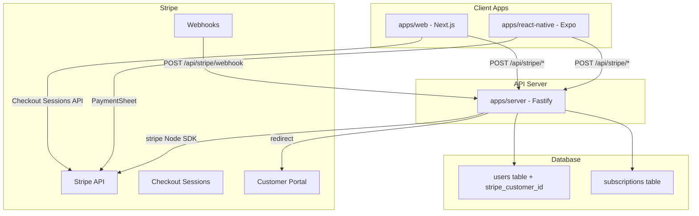
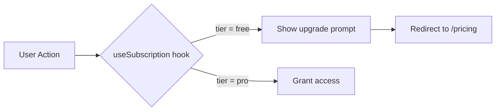

# Stripe Payment Integration Plan

## Architecture Overview



## 1. Environment Variables

### apps/server `.env.example`

- `STRIPE_SECRET_KEY` -- Stripe secret API key (`sk_test_...`)
- `STRIPE_WEBHOOK_SECRET` -- Webhook signing secret (`whsec_...`)
- `STRIPE_PRICE_PRO_MONTHLY` -- Price ID for monthly Pro plan (`price_...`)
- `STRIPE_PRICE_PRO_YEARLY` -- Price ID for yearly Pro plan (`price_...`)

### apps/web `.env.example`

- `NEXT_PUBLIC_STRIPE_PUBLISHABLE_KEY` -- Stripe publishable key (`pk_test_...`)
- `NEXT_PUBLIC_API_URL` -- Server API URL (`http://localhost:3001`)

### apps/react-native `.env.example`

- `EXPO_PUBLIC_STRIPE_PUBLISHABLE_KEY` -- Stripe publishable key (`pk_test_...`)
- `EXPO_PUBLIC_API_URL` -- Server API URL (`http://localhost:3001`)
- `EXPO_PUBLIC_MERCHANT_IDENTIFIER` -- Apple Pay merchant ID (`merchant.com.mastermind.app`)

## 2. Graceful Fallback When Stripe Keys Are Missing

The app must never crash or show errors when Stripe env vars are absent. Follow the same pattern as Google Analytics (conditionally rendered in `layout.tsx`) and MiniKit (`isInstalled()` guard).

### Web (`apps/web`)

- `**src/lib/stripe.ts**`: Export a `getStripe()` that returns `null` if `NEXT_PUBLIC_STRIPE_PUBLISHABLE_KEY` is undefined. Never call `loadStripe` with an empty string.
- **Stripe Provider**: Conditionally wrap children only when the key exists. If missing, render children directly (passthrough).
- **Pricing page**: Check `stripeEnabled` at the top. If Stripe is not configured, show a friendly "Payments not configured" message instead of a broken checkout. The `/pricing` route still works -- it just shows a notice.
- `**useSubscription` hook: If the API URL or Stripe key is missing, return a default `{ tier: "free", isProUser: false, hasFeature: () => true }` -- treat all features as unlocked so the app is fully usable without Stripe.
- **Navigation link**: Always show the "Pricing" link (so routing doesn't break), but the page handles the missing-config case gracefully.

### React Native (`apps/react-native`)

- `**StripeProvider`: Only wrap the app if `EXPO_PUBLIC_STRIPE_PUBLISHABLE_KEY` is set. Otherwise, render children without the provider.
- `**useStripeCheckout` hook: Return `{ isAvailable: false }` when the key is missing. The checkout button disables or hides itself.
- **Pricing screen**: Same pattern as web -- shows "Payments not configured" if Stripe is absent.

### Server (`apps/server`)

- **Stripe routes**: At registration time, check if `STRIPE_SECRET_KEY` exists. If not, the routes still register but return `503 { error: "stripe_not_configured" }` instead of crashing.
- **Webhook route**: Skip signature verification gracefully if `STRIPE_WEBHOOK_SECRET` is missing (log a warning in dev).

### Helper pattern

```typescript
// apps/web/src/lib/stripe.ts
const stripePublishableKey = process.env.NEXT_PUBLIC_STRIPE_PUBLISHABLE_KEY;
export const stripeEnabled = Boolean(stripePublishableKey);
export const getStripe = () =>
  stripeEnabled ? loadStripe(stripePublishableKey!) : null;
```

This mirrors the existing GA pattern: `{gaId && <GoogleAnalytics gaId={gaId} />}`.

## 3. Package Dependencies

- **apps/server**: `stripe` (Node SDK)
- **apps/web**: `@stripe/stripe-js`, `@stripe/react-stripe-js` (Checkout Sessions API + Payment Element)
- **apps/react-native**: `@stripe/stripe-react-native` (PaymentSheet)

## 3. Database Schema Changes -- `packages/db`

### Modify [packages/db/src/schema/users.ts](packages/db/src/schema/users.ts)

- Add `stripeCustomerId` column (nullable text, unique) to existing `users` table

### New file: `packages/db/src/schema/subscriptions.ts`

Subscriptions table schema:

- `id` -- uuid PK, defaultRandom
- `userId` -- uuid FK to users.id
- `stripeSubscriptionId` -- text, unique
- `stripePriceId` -- text
- `status` -- text enum: active, canceled, past_due, trialing, incomplete
- `currentPeriodStart` -- timestamp with timezone
- `currentPeriodEnd` -- timestamp with timezone
- `cancelAtPeriodEnd` -- boolean, default false
- `createdAt` / `updatedAt` -- timestamps

### Update [packages/db/src/schema/index.ts](packages/db/src/schema/index.ts)

- Export new `subscriptions` table and relations

## 4. Server API Routes -- `apps/server`

### New file: `apps/server/src/routes/stripe.ts`

All routes prefixed with `/api/stripe`:

- **POST `/create-checkout-session`** -- Creates a Stripe Checkout Session for subscription signup (`mode: "subscription"`). Returns `{ url }` for redirect (web) or `{ clientSecret }` for embedded.
- **POST `/create-payment-intent`** -- Creates a PaymentIntent for one-time payments. Returns `{ clientSecret, customer, publishableKey }`. Used by React Native PaymentSheet.
- **POST `/create-portal-session`** -- Creates a Stripe Customer Portal session. Returns `{ url }`.
- **POST `/webhook`** -- Handles Stripe webhook events: `checkout.session.completed`, `customer.subscription.updated`, `customer.subscription.deleted`, `invoice.paid`, `invoice.payment_failed`.
- **GET `/subscription-status`** -- Returns the current user's subscription status and tier for client-side gating.

Register in [apps/server/src/app.ts](apps/server/src/app.ts).

## 5. Web App -- `apps/web`

### Integration Approach: Stripe-Hosted Checkout for Subscriptions

Stripe recommends the **Checkout Sessions API** over raw PaymentIntents. For subscriptions, we use Stripe-hosted Checkout (redirect) -- lowest complexity, highest conversion. For the embedded demo, we use the `CheckoutProvider` from `@stripe/react-stripe-js/checkout`.

### New files:

- `**src/app/pricing/page.tsx` -- Pricing page with Free / Pro tier cards, "Subscribe" CTA
- `**src/app/pricing/success/page.tsx` -- Post-checkout success page (retrieves Checkout Session status)
- `**src/components/stripe-provider.tsx` -- Wraps `loadStripe` initialization
- `**src/hooks/use-subscription.ts` -- React Query hook to fetch `/api/stripe/subscription-status`
- `**src/lib/stripe.ts` -- `loadStripe` singleton

### i18n namespace: `pricing.json`

- Add `pricing.json` to all 3 locales (`en`, `zh`, `es`) with keys for pricing page strings
- Register namespace in [apps/web/src/i18n/index.ts](apps/web/src/i18n/index.ts)

### Update [apps/web/src/app/page.tsx](apps/web/src/app/page.tsx)

- Add a link/button to `/pricing` from the main page

## 6. React Native App -- `apps/react-native`

### Integration Approach: PaymentSheet

React Native uses `@stripe/stripe-react-native` with the **PaymentSheet** (native UI that collects payment details). This talks to the server's `/create-payment-intent` endpoint.

### New/updated files:

- **Update `app/_layout.tsx`** -- Wrap with `StripeProvider` from `@stripe/stripe-react-native`
- `**app/(tabs)/pricing.tsx**` -- Pricing screen with tier cards and checkout button
- `**hooks/use-subscription.ts**` -- Fetches subscription status from server
- `**hooks/use-stripe-checkout.ts**` -- Hook wrapping `initPaymentSheet` + `presentPaymentSheet`

### Update tab layout

- Add a "Pricing" or "Premium" tab in `app/(tabs)/_layout.tsx`

### i18n

- Add `pricing.json` to all locale directories under `i18n/locales/`

## 7. Feature Gating Design

### Tier Model

Define a simple tier system with a shared config:

```typescript
const FEATURES = {
  basicAnalytics: ["free", "pro"],
  advancedAnalytics: ["pro"],
  exportData: ["pro"],
  prioritySupport: ["pro"],
  customBranding: ["pro"],
} as const;
```

### How Gating Works



- **Server-side**: Middleware on protected API routes checks the user's subscription status from DB. Returns 403 with `{ error: "upgrade_required", requiredTier: "pro" }` if insufficient.
- **Client-side**: `useSubscription()` hook returns `{ tier, isProUser, hasFeature(featureName) }`. Components use `hasFeature()` to conditionally render content or show an upgrade prompt.
- **Webhook-driven**: Subscription changes propagate via Stripe webhooks to keep the DB in sync. The client re-fetches on focus/navigation.

### Gating UI Patterns

- **Soft gate**: Feature is visible but disabled with a lock icon and "Upgrade to Pro" badge
- **Hard gate**: Feature is hidden entirely for free users
- **Usage gate**: Feature works N times for free, then requires upgrade (future extension)

### Demo on the Pricing Page

The pricing page itself demonstrates gating by showing:

- A comparison table of Free vs Pro features
- A "Try Premium Feature" section that checks subscription status and shows either the feature or an upgrade CTA
- A "Manage Billing" button linking to Customer Portal for existing subscribers

## 8. Cursor Rules (synced to all 3 rule dirs)

Per rule `012-rule-sync`, every rule must be identical across `.cursor/rules/`, `.agents/rules/`, and `.claude/rules/`. Also update `AGENTS.md` if the rule affects a core convention documented there.

### New rule: `016-stripe-payments.mdc`

Covers Stripe integration conventions for this monorepo:

- **API Selection**: Use Checkout Sessions API (not raw PaymentIntents) for web payments and subscriptions. Use PaymentSheet for React Native. Reference Stripe's latest API version `2026-02-25.clover`.
- **Environment Variables**: `STRIPE_SECRET_KEY` and `STRIPE_WEBHOOK_SECRET` are server-only. `NEXT_PUBLIC_STRIPE_PUBLISHABLE_KEY` / `EXPO_PUBLIC_STRIPE_PUBLISHABLE_KEY` are client-side. Never expose secret keys.
- **Server SDK**: All Stripe API calls go through `apps/server` using the `stripe` Node SDK. Clients never call the Stripe API directly for secret operations.
- **Webhook Handling**: Always verify webhook signatures. Handle idempotency. Required events: `checkout.session.completed`, `customer.subscription.updated`, `customer.subscription.deleted`, `invoice.paid`, `invoice.payment_failed`.
- **Database Sync**: Store `stripeCustomerId` on users, maintain `subscriptions` table via webhooks. Never trust client-side subscription status for access control.
- **Customer Portal**: Use Stripe's hosted Customer Portal for subscription management (cancel, update payment method). Don't rebuild this UI.
- **Graceful Fallback**: All Stripe features must degrade gracefully when env vars are missing. Export `stripeEnabled` from `src/lib/stripe.ts`. Conditionally render providers/UI. Server routes return 503 instead of crashing. Follow the same pattern as Google Analytics (`{gaId && <GoogleAnalytics />}`) and MiniKit (`isInstalled()` guard).
- **Testing**: Use Stripe test mode keys and test card numbers (`4242 4242 4242 4242`). Use Stripe CLI for local webhook testing.
- **DO / DO NOT** checklist following the style of existing rules (including: DO check `stripeEnabled` before rendering Stripe UI, DO NOT call `loadStripe` with an empty/undefined key).

### New rule: `017-feature-gating.mdc`

Covers feature gating and subscription-based access control:

- **Tier Model**: Define tiers (`free`, `pro`) and a `FEATURES` map that associates feature keys with required tiers. Keep this as a shared config importable by both web and react-native.
- **Server-side Enforcement**: Protected API routes must check the user's subscription tier from the database. Return `403 { error: "upgrade_required", requiredTier }` when access is denied. Never rely solely on client-side checks.
- **Client-side Gating**: Use `useSubscription()` hook returning `{ tier, isProUser, hasFeature(key) }`. Components check `hasFeature()` to conditionally render or show upgrade prompts.
- **Gating UI Patterns**: Soft gate (visible but locked with upgrade badge), hard gate (hidden), usage gate (N free uses).
- **Webhook-Driven Sync**: Subscription status must propagate via Stripe webhooks. Client refetches on window focus.
- **DO / DO NOT** checklist.

### New rule: `018-skill-sync.mdc`

Mirrors the pattern of [.cursor/rules/012-rule-sync.mdc](.cursor/rules/012-rule-sync.mdc) but for skills. Currently skills only exist in `.agents/skills/`. This rule establishes the convention to keep them synced across all three tool directories.

Skills exist in three parallel directories that must stay identical:

- `.agents/skills/` -- Codex / generic agents
- `.cursor/skills/` -- Cursor
- `.claude/skills/` -- Claude Code

When creating, editing, or deleting any skill, apply the same change to all three directories.

Workflow:

1. Make the change in `.agents/skills/<skill-name>/SKILL.md`
2. Copy the identical folder to `.cursor/skills/<skill-name>/SKILL.md` and `.claude/skills/<skill-name>/SKILL.md`
3. If a skill is deleted, delete it from all three directories
4. If the skill has additional files (e.g. `LICENSE.txt`, reference docs), copy those too

This also means the existing 11 skills in `.agents/skills/` need to be copied to `.cursor/skills/` and `.claude/skills/` as a one-time migration.

## 9. Agent Skills

### New skill: `.agents/skills/stripe-integration/SKILL.md`

A comprehensive skill for Stripe integration in this monorepo. Includes:

- **Integration routing table** (from Stripe's official best practices): which Stripe API to use for one-time payments, subscriptions, saving payment methods, etc.
- **Web integration pattern**: Checkout Sessions API + `CheckoutProvider` from `@stripe/react-stripe-js/checkout` with `useCheckout()` hook, `confirm()` flow.
- **React Native integration pattern**: `@stripe/stripe-react-native` StripeProvider + `useStripe()` hook with `initPaymentSheet` / `presentPaymentSheet`.
- **Server integration pattern**: Fastify route structure, `stripe` Node SDK initialization, webhook signature verification, Checkout Session creation with `mode: "subscription"` or `"payment"`.
- **Webhook handling**: Event types to listen for, idempotency, database sync.
- **Testing**: Test card numbers, Stripe CLI webhook forwarding, sandbox vs live mode.
- **Key documentation links**: Points to Stripe docs for Checkout Sessions, Payment Element, Customer Portal, Billing, Webhooks.
- References Stripe API version `2026-02-25.clover`.

### New skill: `.agents/skills/feature-gating/SKILL.md`

A skill for implementing feature gating and paywall patterns. Includes:

- **Tier architecture**: How to define a tier config with feature-to-tier mapping. Extensible to more tiers later.
- **Server middleware pattern**: Fastify preHandler/hook that reads subscription from DB, attaches `tier` to request, rejects with 403 if insufficient.
- **Client hook pattern**: `useSubscription()` with React Query, `hasFeature()` helper, stale-while-revalidate caching, refetch on focus.
- **UI component patterns**: `<FeatureGate>` wrapper component, `<UpgradePrompt>` with pricing link, lock icon overlay pattern, comparison tables.
- **Common pitfalls**: Never gate solely on client, always verify server-side. Handle grace periods for canceled subscriptions. Cache subscription status but with short TTL.
- **Testing feature gates**: How to mock subscription status in tests.

## 10. Stripe Dashboard Setup (Manual Pre-requisite)

Before the code works end-to-end, these must be configured in the [Stripe Dashboard](https://dashboard.stripe.com):

1. Create Products: "Free" (no price) and "Pro" with monthly/yearly recurring prices
2. Record the `price_xxx` IDs and set them as `STRIPE_PRICE_PRO_MONTHLY` / `STRIPE_PRICE_PRO_YEARLY` env vars
3. Configure Customer Portal settings (allow cancel, update payment method)
4. Set up webhook endpoint pointing to `{API_URL}/api/stripe/webhook` with events: `checkout.session.completed`, `customer.subscription.updated`, `customer.subscription.deleted`, `invoice.paid`, `invoice.payment_failed`
5. Copy webhook signing secret to `STRIPE_WEBHOOK_SECRET`

## Summary of All New Files

### Rules (synced to `.cursor/rules/` + `.agents/rules/` + `.claude/rules/`)

- `016-stripe-payments.mdc`
- `017-feature-gating.mdc`
- `018-skill-sync.mdc`

### Skills (synced to `.agents/skills/` + `.cursor/skills/` + `.claude/skills/` per 018-skill-sync)

- `stripe-integration/SKILL.md`
- `feature-gating/SKILL.md`
- One-time migration: copy existing 11 skills from `.agents/skills/` to `.cursor/skills/` and `.claude/skills/`

### Database

- `packages/db/src/schema/subscriptions.ts`

### Server

- `apps/server/src/routes/stripe.ts`

### Web

- `apps/web/src/app/pricing/page.tsx`
- `apps/web/src/app/pricing/success/page.tsx`
- `apps/web/src/components/stripe-provider.tsx`
- `apps/web/src/hooks/use-subscription.ts`
- `apps/web/src/lib/stripe.ts`
- `apps/web/src/i18n/locales/{en,zh,es}/pricing.json`

### React Native

- `apps/react-native/app/(tabs)/pricing.tsx`
- `apps/react-native/hooks/use-subscription.ts`
- `apps/react-native/hooks/use-stripe-checkout.ts`
- `apps/react-native/i18n/locales/{en,zh,es}/pricing.json`
