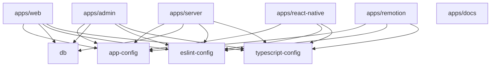

## Directory structure

```
blueprint/
├── apps/
│   ├── web/             → Main web app (Next.js 15 + shadcn/ui + Tailwind CSS v4)   :3000
│   ├── admin/           → Admin panel (Next.js 15 + shadcn/ui + Tailwind CSS v4)   :3002
│   ├── docs/            → Documentation (Mintlify)                                  :3003
│   ├── react-native/    → Mobile app (Expo + Expo Router + NativeWind)
│   ├── remotion/        → Video generation (Remotion)                               :3004
│   └── server/          → API server (Fastify + Swagger)                            :3001
├── packages/
│   ├── app-config/      → Centralized app metadata, branding, and assets
│   ├── blueprint-cli/   → npx blueprint CLI (scaffold & workspace commands)
│   ├── db/              → Drizzle ORM schema + Neon PostgreSQL client
│   ├── eslint-config/   → Shared ESLint configuration
│   └── typescript-config/ → Shared TypeScript configuration
├── prompts/             → AI prompt library (branding, design systems, components)
├── turbo.json           → Turborepo pipeline configuration
└── pnpm-workspace.yaml  → pnpm workspace definition
```

## Package dependency graph



## Apps

### `apps/web` — Main web application

- **Stack**: Next.js 15, React 19, Tailwind CSS v4, shadcn/ui
- **Port**: 3000
- **Key directories**:
  - `src/app/` — Next.js App Router pages and layouts
  - `src/components/` — UI components (shadcn primitives + feature components)
  - `src/hooks/` — React Query hooks for every API call
  - `src/i18n/` — i18next config and locale JSON files
  - `src/lib/` — Utilities, feature flags, stripe/dynamic/elevenlabs clients

### `apps/admin` — Admin panel

- **Stack**: Next.js 15, Tailwind CSS v4, shadcn/ui
- **Port**: 3002
- Isolated from `apps/web` — has its own independent shadcn/ui install and theme

### `apps/server` — API server

- **Stack**: Fastify, Swagger/OpenAPI, Drizzle ORM
- **Port**: 3001
- **Key directories**:
  - `src/routes/` — All Fastify route handlers (schema-first)
  - `src/plugins/` — Fastify plugins (auth middleware, CORS, etc.)
- Interactive Swagger UI at `http://localhost:3001/docs`

### `apps/react-native` — Mobile app

- **Stack**: Expo SDK, Expo Router, NativeWind (Tailwind for RN)
- Feature parity with `apps/web` is enforced by the [co-development convention](/features/co-development)
- Shares hook names and data shapes with the web app

### `apps/remotion` — Video generation

- **Stack**: Remotion
- **Port**: 3004
- Programmatic video compositions using React. Uses `@repo/app-config` for branding.

### `apps/docs` — Documentation

- **Stack**: Mintlify
- **Port**: 3003
- This documentation site. `docs.json` is patched by `pnpm sync-config`.

## Packages

### `packages/app-config`

The **single source of truth** for all app metadata. Exports `appConfig` with name, colors, URLs, socials, and mobile identifiers. The `pnpm sync-config` command propagates config to all apps and generates theme CSS.

### `packages/db`

Shared Drizzle ORM schema and Neon PostgreSQL client. All apps that need database access import from `@repo/db`. Schema lives in `src/schema/`.

### `packages/blueprint-cli`

Powers `npx blueprint new`. Interactive scaffolder that lets users select features and removes unused code from the template. See [CLI Reference](/extending/cli).

### `packages/eslint-config`

Shared ESLint configs consumed by all apps via `@repo/eslint-config`.

### `packages/typescript-config`

Shared `tsconfig` base files consumed by all apps via `@repo/typescript-config`.

## Design decisions

**Independent shadcn/ui installs per Next.js app**
`apps/web` and `apps/admin` each have their own shadcn/ui installation. This allows different themes, independent upgrades, and prevents cross-app component coupling. Never copy shadcn components between apps — install them independently.

**Single shared database package**
`packages/db` is the only place database schema and types live. All apps (`web`, `admin`, `server`) import from `@repo/db`, giving a single source of truth with full TypeScript type safety across the stack.

**Expo Router for file-based mobile routing**
Consistent with Next.js App Router — both use file-based routing. This reduces cognitive overhead when co-developing.

**Fastify + schema-first Swagger**
Every API endpoint must define a Fastify schema. This is not optional — schemas are used to auto-generate the OpenAPI spec at `http://localhost:3001/docs`.

**Turborepo for orchestration**
`turbo.json` defines the task pipeline. `pnpm dev` runs all apps in parallel with correct dependency ordering. Build caching is enabled.
